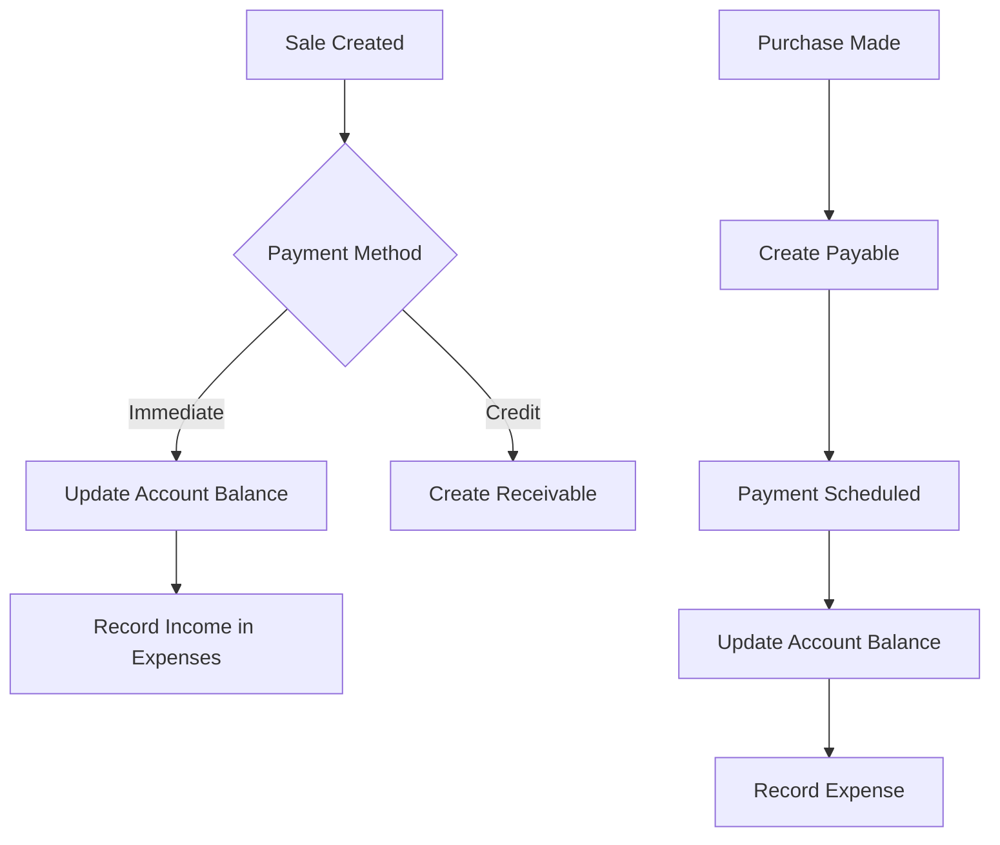

## Accounting Architecture

PixelTech uses a double-entry inspired system with three core collections:

- **expenses**: All financial transactions (income + expenses)
- **accounts**: Bank accounts and cash registers (treasury)
- **payables**: Supplier invoices and debts

### Transaction Flow



## Expense Tracking

### Expense Document Structure

```javascript
{
  description: "Compra inventario electrónica",
  amount: 5000000,
  type: "EXPENSE" | "INCOME",
  category: "Inventario",           // or "Logística", "Impuestos", etc.
  paymentMethod: "Banco Davivienda", // Name of account
  supplierName: "Importadora XYZ",
  supplierId: "supplier123",         // Optional reference
  date: Timestamp,                   // Transaction date
  createdAt: Timestamp
}
```

### Recording Expenses

From `admin-expenses.js`:

```javascript
form.addEventListener('submit', async (e) => {
    e.preventDefault();
    
    const amount = getCleanAmount();
    const accountId = accountSelect.value;
    const accountData = accounts.find(a => a.id === accountId);
    
    // Calculate 4x1000 tax for bank accounts
    let tax = 0;
    if (accountData.type === 'banco' && !accountData.isExempt) {
        tax = Math.ceil(amount * 0.004);
    }
    
    const totalDeduction = amount + tax;
    
    await runTransaction(db, async (t) => {
        const accRef = doc(db, "accounts", accountId);
        const accDoc = await t.get(accRef);
        
        if (accDoc.data().balance < totalDeduction) {
            throw `Saldo insuficiente en ${accDoc.data().name}`;
        }
        
        // Deduct from account
        t.update(accRef, { 
            balance: accDoc.data().balance - totalDeduction 
        });
        
        // Record tax expense separately
        if (tax > 0) {
            t.set(doc(collection(db, "expenses")), {
                description: `4x1000 ${description}`,
                amount: tax,
                type: 'EXPENSE',
                category: "Impuestos",
                paymentMethod: accountData.name,
                date: Timestamp.fromDate(dateVal),
                createdAt: Timestamp.now(),
                supplierName: "DIAN / Banco"
            });
        }
        
        // Record main expense
        t.set(doc(collection(db, "expenses")), {
            supplierId: supplierId,
            supplierName: supplierName,
            description: description,
            category: category,
            amount: amount,
            type: 'EXPENSE',
            paymentMethod: accountData.name,
            date: Timestamp.fromDate(dateVal),
            createdAt: Timestamp.now()
        });
    });
});
```

<Info>
  **4x1000 Tax**: Colombian financial transaction tax (0.4%) is automatically calculated and recorded separately for bank payments.
</Info>

### Expense Categories

- **Inventario**: Product purchases
- **Logística**: Shipping and delivery costs
- **Pago Proveedores**: Supplier invoice payments
- **Impuestos**: Taxes and government fees
- **Servicios**: Utilities, internet, etc.
- **Nómina**: Employee salaries
- **Ingreso Ventas**: Customer payments (type: INCOME)

### Smart Real-Time List

```javascript
function startExpensesListener(isNextPage = false) {
    const coll = collection(db, "expenses");
    let constraints = [
        where("type", "==", "EXPENSE"),
        orderBy("date", "desc")
    ];
    
    // Filter by month if selected
    if (currentFilterDate) {
        const start = Timestamp.fromDate(currentFilterDate);
        const nextMonth = new Date(
            currentFilterDate.getFullYear(), 
            currentFilterDate.getMonth() + 1, 
            0, 23, 59, 59
        );
        const end = Timestamp.fromDate(nextMonth);
        
        constraints.push(where("date", ">=", start));
        constraints.push(where("date", "<=", end));
    }
    
    constraints.push(limit(50));
    
    if (isNextPage && lastDoc) {
        constraints.push(startAfter(lastDoc));
        const q = query(coll, ...constraints);
        getDocs(q).then(handleSnapshot);
    } else {
        const q = query(coll, ...constraints);
        unsubscribeExpensesList = onSnapshot(q, handleSnapshot);
    }
}
```

## Accounts Receivable (Cartera)

### Customer Debt Tracking

Orders with pending payments are automatically tracked:

```javascript
const SmartCarteraSync = {
    listenForReceivables() {
        const colRef = collection(db, "orders");
        const q = query(
            colRef, 
            where("paymentStatus", "in", ["PENDING", "PARTIAL"])
        );
        
        unsubscribeOrders = onSnapshot(q, (snapshot) => {
            snapshot.docChanges().forEach(change => {
                const data = change.doc.data();
                const id = change.doc.id;
                
                const total = cleanNumber(data.total);
                const paid = cleanNumber(data.amountPaid);
                const balance = total - paid;
                
                if (balance > 0 && data.status !== 'CANCELADO') {
                    this.runtimeRecMap[id] = {
                        id,
                        userId: data.userId,
                        userName: data.userName,
                        total: data.total,
                        amountPaid: data.amountPaid
                    };
                } else {
                    delete this.runtimeRecMap[id];
                }
            });
            
            this.calculateAndRender();
        });
    }
};
```

### Grouped by Customer

From `admin-cartera.js`:

```javascript
function calculateAndRender() {
    const clientMap = {};
    let totalRecAmount = 0;
    
    Object.values(this.runtimeRecMap).forEach(order => {
        const total = cleanNumber(order.total);
        const paid = cleanNumber(order.amountPaid);
        const balance = total - paid;
        
        if (balance > 0) {
            let name = order.userName || `Cliente (ID: ${order.id.slice(0,4)})`;
            const key = order.userId || name;
            
            if (!clientMap[key]) {
                clientMap[key] = {
                    id: key,
                    name: name,
                    count: 0,
                    totalDebt: 0
                };
            }
            
            clientMap[key].count++;
            clientMap[key].totalDebt += balance;
            totalRecAmount += balance;
        }
    });
    
    groupedReceivables = Object.values(clientMap).sort((a, b) => b.totalDebt - a.totalDebt);
}
```

### Payment Processing

Record partial or full payment:

```javascript
await runTransaction(db, async (t) => {
    const accRef = doc(db, "accounts", accountId);
    const orderRefs = docsToProcess.map(item => item.ref);
    
    const [accDoc, ...orderDocs] = await Promise.all([
        t.get(accRef),
        ...orderRefs.map(ref => t.get(ref))
    ]);
    
    let remainingMoney = amount;
    
    for (const orderDoc of orderDocs) {
        if (remainingMoney <= 0) break;
        
        const data = orderDoc.data();
        const currentPaid = cleanNumber(data.amountPaid);
        const total = cleanNumber(data.total);
        const debt = total - currentPaid;
        
        const apply = Math.min(remainingMoney, debt);
        const newPaid = currentPaid + apply;
        
        t.update(orderDoc.ref, {
            amountPaid: newPaid,
            paymentStatus: newPaid >= total ? 'PAID' : 'PARTIAL',
            lastPaymentDate: new Date(),
            updatedAt: new Date()
        });
        
        remainingMoney -= apply;
    }
    
    // Update account balance (income)
    t.update(accRef, { 
        balance: accDoc.data().balance + amount 
    });
    
    // Record income
    t.set(doc(collection(db, "expenses")), {
        description: `Abono Cliente: ${customerName}`,
        amount: amount,
        type: 'INCOME',
        category: "Ingreso Ventas",
        paymentMethod: accDoc.data().name,
        supplierName: customerName,
        date: new Date(),
        createdAt: new Date()
    });
});
```

<Warning>
  **FIFO Payment Application**: Payments are applied to oldest invoices first unless paying a specific order.
</Warning>

## Accounts Payable

### Supplier Debt Management

```javascript
// Create payable from purchase
await addDoc(collection(db, "payables"), {
    provider: "Importadora XYZ SAS",
    description: "Factura #12345 - Inventario junio",
    total: 10000000,
    amountPaid: 0,
    balance: 10000000,
    status: "PENDING",      // PENDING | PARTIAL | PAID
    dueDate: Timestamp.fromDate(new Date("2024-07-15")),
    createdAt: Timestamp.now()
});
```

### Payment to Supplier

```javascript
await runTransaction(db, async (t) => {
    const accRef = doc(db, "accounts", accountId);
    const payableRef = doc(db, "payables", payableId);
    
    const [accDoc, payableDoc] = await Promise.all([
        t.get(accRef),
        t.get(payableRef)
    ]);
    
    const currentPaid = payableDoc.data().amountPaid || 0;
    const total = payableDoc.data().total;
    const newPaid = currentPaid + amount;
    
    // Update payable
    t.update(payableRef, {
        amountPaid: newPaid,
        balance: total - newPaid,
        status: newPaid >= total ? 'PAID' : 'PENDING',
        lastPaymentDate: new Date()
    });
    
    // Deduct from account
    t.update(accRef, { 
        balance: accDoc.data().balance - amount 
    });
    
    // Record expense
    t.set(doc(collection(db, "expenses")), {
        description: `Pago Proveedor: ${payableDoc.data().provider}`,
        amount: amount,
        type: 'EXPENSE',
        category: "Pago Proveedores",
        paymentMethod: accDoc.data().name,
        supplierName: payableDoc.data().provider,
        date: new Date(),
        createdAt: new Date()
    });
});
```

## Treasury Module

### Account Management

```javascript
// Account structure
{
  name: "Banco Davivienda",
  type: "banco" | "efectivo" | "daviplata" | "nequi",
  balance: 15000000,
  isExempt: false,    // Exempt from 4x1000 tax?
  createdAt: Timestamp
}
```

### Real-Time Balance Updates

```javascript
function listenForAccounts() {
    const q = query(collection(db, "accounts"), orderBy("name", "asc"));
    
    unsubscribeAccounts = onSnapshot(q, (snap) => {
        accounts = [];
        snap.forEach(d => accounts.push({ id: d.id, ...d.data() }));
        
        sessionStorage.setItem('pixeltech_admin_accounts_cache', JSON.stringify(accounts));
        renderAccountsDropdown();
        updateTreasuryKPI();
    });
}

function updateTreasuryKPI() {
    const totalBalance = accounts.reduce((sum, acc) => sum + (acc.balance || 0), 0);
    document.getElementById('stat-treasury').textContent = `$${totalBalance.toLocaleString('es-CO')}`;
}
```

### Inter-Account Transfers

```javascript
await runTransaction(db, async (t) => {
    const fromRef = doc(db, "accounts", fromAccountId);
    const toRef = doc(db, "accounts", toAccountId);
    
    const [fromDoc, toDoc] = await Promise.all([
        t.get(fromRef),
        t.get(toDoc)
    ]);
    
    if (fromDoc.data().balance < amount) {
        throw "Saldo insuficiente para transferencia";
    }
    
    t.update(fromRef, { balance: fromDoc.data().balance - amount });
    t.update(toRef, { balance: toDoc.data().balance + amount });
    
    // Record expense (withdrawal)
    t.set(doc(collection(db, "expenses")), {
        description: `Transferencia a ${toDoc.data().name}`,
        amount: amount,
        type: 'EXPENSE',
        category: "Transferencias",
        paymentMethod: fromDoc.data().name,
        date: new Date(),
        createdAt: new Date()
    });
    
    // Record income (deposit)
    t.set(doc(collection(db, "expenses")), {
        description: `Transferencia desde ${fromDoc.data().name}`,
        amount: amount,
        type: 'INCOME',
        category: "Transferencias",
        paymentMethod: toDoc.data().name,
        date: new Date(),
        createdAt: new Date()
    });
});
```

## Expense Deletion and Audit Trail

### Reversal Logic

Deleting expenses reverses all effects:

```javascript
window.deleteExpense = async (id) => {
    const expenseSnap = await getDoc(doc(db, "expenses", id));
    const expenseData = expenseSnap.data();
    
    const amountToReverse = Number(expenseData.amount);
    const accountName = expenseData.paymentMethod;
    const isSupplierPayment = expenseData.category === "Pago Proveedores";
    
    // Find account
    const accQuery = query(
        collection(db, "accounts"),
        where("name", "==", accountName),
        limit(1)
    );
    const accSnapshot = await getDocs(accQuery);
    const accountRef = accSnapshot.docs[0].ref;
    
    // Find related payables to reopen
    let payablesToReopen = [];
    if (isSupplierPayment) {
        const payQuery = query(
            collection(db, "payables"),
            where("provider", "==", expenseData.supplierName),
            where("amountPaid", ">", 0)
        );
        const pSnap = await getDocs(payQuery);
        
        // Sort by last payment date (reverse chronological)
        const docs = pSnap.docs.map(d => ({ ...d.data(), ref: d.ref }));
        docs.sort((a, b) => b.lastPaymentDate?.seconds - a.lastPaymentDate?.seconds);
        
        let remaining = amountToReverse;
        for (const p of docs) {
            if (remaining <= 0) break;
            const subtract = Math.min(remaining, p.amountPaid);
            payablesToReopen.push({ ref: p.ref, subtract, currentPaid: p.amountPaid, total: p.total });
            remaining -= subtract;
        }
    }
    
    await runTransaction(db, async (t) => {
        // Refund to account
        const accDoc = await t.get(accountRef);
        t.update(accountRef, { 
            balance: accDoc.data().balance + amountToReverse 
        });
        
        // Reopen payables
        for (const item of payablesToReopen) {
            const newPaid = item.currentPaid - item.subtract;
            t.update(item.ref, {
                amountPaid: newPaid,
                balance: item.total - newPaid,
                status: newPaid === 0 ? 'PENDING' : 'PARTIAL'
            });
        }
        
        // Move to trash (audit trail)
        t.set(doc(db, "expenses_trash", id), {
            ...expenseData,
            deletedAt: Timestamp.now(),
            deletedBy: getCurrentAdminName(),
            reversalType: isSupplierPayment ? "FULL_REVERSAL" : "REFUND_ONLY"
        });
        
        // Delete original
        t.delete(doc(db, "expenses", id));
    });
};
```

<Info>
  **Audit Trail**: Deleted expenses are moved to `expenses_trash` collection with deletion metadata.
</Info>

## Financial Reports

### Monthly Summary

```javascript
async function loadStats() {
    const coll = collection(db, "expenses");
    let constraints = [where("type", "==", "EXPENSE")];
    
    if (currentFilterDate) {
        const start = Timestamp.fromDate(currentFilterDate);
        const nextMonth = new Date(
            currentFilterDate.getFullYear(),
            currentFilterDate.getMonth() + 1,
            0, 23, 59, 59
        );
        const end = Timestamp.fromDate(nextMonth);
        
        constraints.push(where("date", ">=", start));
        constraints.push(where("date", "<=", end));
    }
    
    const q = query(coll, ...constraints);
    const snap = await getAggregateFromServer(q, { 
        total: sum('amount') 
    });
    
    const totalExpenses = snap.data().total || 0;
    document.getElementById('stats-total').textContent = 
        `$${Math.round(totalExpenses).toLocaleString('es-CO')}`;
}
```

### Cash Flow Analysis

```javascript
const startDate = new Date('2024-01-01');
const endDate = new Date('2024-12-31');

const expensesQuery = query(
    collection(db, "expenses"),
    where("type", "==", "EXPENSE"),
    where("date", ">=", startDate),
    where("date", "<=", endDate)
);

const incomeQuery = query(
    collection(db, "expenses"),
    where("type", "==", "INCOME"),
    where("date", ">=", startDate),
    where("date", "<=", endDate)
);

const [expSnap, incSnap] = await Promise.all([
    getAggregateFromServer(expensesQuery, { total: sum('amount') }),
    getAggregateFromServer(incomeQuery, { total: sum('amount') })
]);

const totalExpenses = expSnap.data().total || 0;
const totalIncome = incSnap.data().total || 0;
const netProfit = totalIncome - totalExpenses;

console.log({
    totalIncome,
    totalExpenses,
    netProfit,
    profitMargin: (netProfit / totalIncome * 100).toFixed(2) + '%'
});
```

## Best Practices

<AccordionGroup>
  <Accordion title="Transaction Integrity">
    - Always use Firestore transactions for multi-document updates
    - Never manually adjust account balances without recording in expenses
    - Validate sufficient funds before processing payments
    - Use atomic operations to prevent race conditions
  </Accordion>
  
  <Accordion title="Tax Compliance">
    - Automatically calculate 4x1000 for bank transactions
    - Record tax expenses separately for reporting
    - Keep digital copies of supplier invoices
    - Generate monthly tax reports
  </Accordion>
  
  <Accordion title="Debt Management">
    - Track payment due dates for suppliers
    - Monitor customer credit limits
    - Apply FIFO logic for partial payments
    - Send payment reminders automatically
  </Accordion>
  
  <Accordion title="Audit and Compliance">
    - Never permanently delete financial records
    - Use trash collection for deleted items
    - Log all administrative actions
    - Regular reconciliation with bank statements
  </Accordion>
</AccordionGroup>