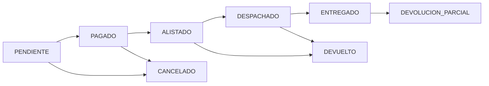

## Order Lifecycle

PixelTech orders follow a structured workflow with distinct statuses:



### Status Definitions

<ResponseField name="PENDIENTE" type="string">
  Order created but awaiting payment confirmation or fulfillment action
</ResponseField>

<ResponseField name="PAGADO" type="string">
  Payment received - **URGENT priority** for packing
</ResponseField>

<ResponseField name="ALISTADO" type="string">
  Items picked and packed, ready for shipment
</ResponseField>

<ResponseField name="DESPACHADO" type="string">
  Order handed to carrier with tracking number
</ResponseField>

<ResponseField name="ENTREGADO" type="string">
  Successfully delivered to customer
</ResponseField>

<ResponseField name="CANCELADO" type="string">
  Order cancelled (payment failed, out of stock, customer request)
</ResponseField>

<ResponseField name="DEVUELTO" type="string">
  Full return - refund issued
</ResponseField>

<ResponseField name="DEVOLUCION_PARCIAL" type="string">
  Partial return - some items refunded
</ResponseField>

## Order List and Filtering

### Real-Time Order Updates

The order view implements smart caching with live updates:

```javascript
const qRecentOrders = query(
    collection(db, "orders"),
    where("status", "in", ["PAGADO", "PENDIENTE", "ALISTADO"]),
    orderBy("createdAt", "desc"),
    limit(100)
);

unsubscribeOrders = onSnapshot(qRecentOrders, (snap) => {
    snap.docChanges().forEach(change => {
        if (['added', 'modified', 'removed'].includes(change.type)) {
            updateOrderTable();
        }
    });
});
```

### Priority Grouping

Orders are automatically grouped by shipping urgency:

```javascript
const cutoffTime = "14:00"; // 2:30 PM
const now = new Date();
const cutoffDateToday = new Date(now);
cutoffDateToday.setHours(14, 30, 0, 0);

ordersSnap.forEach(d => {
    const orderDate = d.data().createdAt.toDate();
    const isToday = orderDate.toDateString() === now.toDateString();
    
    if (isToday && orderDate > cutoffDateToday) {
        tomorrowOrders.push({ id: d.id, ...d.data() });
    } else {
        todayOrders.push({ id: d.id, ...d.data() });
    }
});
```

<Warning>
  Orders marked **PAGADO** require immediate attention - they appear with a pulsing red badge.
</Warning>

## Manual Sales Creation

Create orders directly from the admin panel using `manual-sale.js`:

### Customer Selection

Search existing customers or create new sale:

```javascript
const filtered = manualClientsCache.filter(u => {
    const nameMatch = normalizeText(u.name || "").includes(term);
    const phoneMatch = (u.phone || "").includes(term);
    return nameMatch || phoneMatch;
});
```

### Product Selection with Stock Validation

```javascript
function addManualItemRow() {
    // Product search with real-time availability
    const filtered = manualProductsCache.filter(p => {
        const searchStr = normalizeText(`${p.name} ${p.sku || ''}`);
        return searchStr.includes(term) && p.stock > 0;
    });
}

// Variant-specific stock checking
function updateRowStock(row, product) {
    if (product.combinations && product.combinations.length > 0) {
        const combo = product.combinations.find(c => {
            return c.color === selectedColor && c.capacity === selectedCap;
        });
        currentStock = combo ? combo.stock : 0;
    }
    
    row.querySelector('.p-max-stock').value = currentStock;
}
```

### Shipping Methods

<Tabs>
  <Tab title="Pickup">
    Customer collects from store location
    ```javascript
    shippingData = { address: "📍 Recogida en Local" };
    ```
  </Tab>
  
  <Tab title="Saved Address">
    Use customer's registered delivery address
    ```javascript
    const address = currentUserAddresses[selectedIndex];
    shippingData = {
        department: address.dept,
        city: address.city,
        address: `${address.address} (${address.alias})`
    };
    ```
  </Tab>
  
  <Tab title="New Address">
    Enter custom delivery location
    ```javascript
    shippingData = {
        department: selectedDepartment,
        city: selectedCity,
        address: manualAddress
    };
    ```
  </Tab>
</Tabs>

### Payment Processing

Manual sales support immediate payment or credit:

```javascript
const accountId = document.getElementById('m-payment-account').value;

if (accountId === 'credit') {
    // Accounts receivable
    paymentStatus = 'PENDING';
    amountPaid = 0;
} else {
    // Immediate payment - update treasury
    await runTransaction(db, async (t) => {
        const accountRef = doc(db, "accounts", accountId);
        const accountDoc = await t.get(accountRef);
        
        t.update(accountRef, { 
            balance: accountDoc.data().balance + total 
        });
    });
    
    // Record income in expenses collection
    await addDoc(collection(db, "expenses"), {
        amount: total,
        category: "Ingreso Ventas Manual",
        description: `Cobro Inmediato - Venta a ${custName}`,
        paymentMethod: accountName,
        type: 'INCOME',
        date: new Date()
    });
    
    paymentStatus = 'PAID';
    amountPaid = total;
}
```

<Info>
  **Atomic Operations**: Manual sales use Firestore transactions to ensure inventory, treasury, and order creation succeed or fail together.
</Info>

## Order Details and Status Updates

### Payment Tracking

Orders track payment progress with strict validation:

```javascript
const total = Number(order.total) || 0;
const paid = Number(order.amountPaid) || 0;
const refunded = Number(order.refundedAmount) || 0;

let pendingBalance = total - paid - refunded;
if (pendingBalance < 0) pendingBalance = 0;

const isFullyPaid = order.paymentStatus === 'PAID' || 
                   order.status === 'PAGADO' || 
                   pendingBalance === 0;
```

### Partial Payments

Support installment payments:

```javascript
window.openPaymentModal = (orderId, pendingBalance) => {
    // Display payment form
    document.getElementById('payment-amount-input').max = pendingBalance;
};

// Process payment
await runTransaction(db, async (t) => {
    const orderRef = doc(db, "orders", orderId);
    const orderDoc = await t.get(orderRef);
    
    const currentPaid = orderDoc.data().amountPaid || 0;
    const newPaid = currentPaid + paymentAmount;
    const total = orderDoc.data().total;
    
    t.update(orderRef, {
        amountPaid: newPaid,
        paymentStatus: newPaid >= total ? 'PAID' : 'PARTIAL',
        lastPaymentDate: new Date(),
        updatedAt: new Date()
    });
});
```

## Invoice Generation

### Electronic Invoice Flag

```javascript
const invoiceBtn = order.requiresInvoice 
    ? `<span class="text-blue-500">Factura Solicitada ✓</span>`
    : `<button onclick="requestInvoice('${order.id}')">Solicitar Factura</button>`;
```

### Billing Information

Stored in order document:

```javascript
{
  requiresInvoice: true,
  billingInfo: {
    name: "Empresa ABC SAS",
    id: "901234567-8",
    email: "contabilidad@empresa.com",
    address: "Calle 123 #45-67",
    city: "Bogotá"
  }
}
```

## Remissions (Shipping Documents)

Remissions are generated automatically for each order:

```javascript
await setDoc(doc(db, "remissions", orderRef.id), {
    ...orderData,
    orderId: orderRef.id,
    status: 'PENDIENTE_ALISTAMIENTO',
    type: order.source === 'MANUAL' ? 'DIRECTA' : 'TIENDA_WEB',
    createdAt: new Date()
});
```

### Remission Security Rules

```javascript
match /remissions/{remissionId} {
  allow create: if isAdmin();
  allow read, update, delete: if isAdmin();
}
```

<Warning>
  Only admins can create remissions to prevent accounting discrepancies.
</Warning>

## Order Fulfillment Workflow

### Step 1: Packing (Alistamiento)

Mark items as picked and ready:

```javascript
window.saveAlistamiento = async (callback) => {
    // Collect serial numbers for trackable items
    const serialNumbers = collectSerialNumbers();
    
    await updateDoc(doc(db, "orders", orderId), {
        status: 'ALISTADO',
        packedAt: new Date(),
        serialNumbers: serialNumbers,
        updatedAt: new Date()
    });
    
    if (callback) callback();
};
```

### Step 2: Dispatch

Assign carrier and tracking number:

```javascript
window.confirmDispatch = async (callback) => {
    const carrier = document.getElementById('dispatch-carrier').value;
    const tracking = document.getElementById('dispatch-tracking').value;
    
    if (!carrier || !tracking) {
        alert("Se requiere transportadora y número de guía");
        return;
    }
    
    await updateDoc(doc(db, "orders", orderId), {
        status: 'DESPACHADO',
        carrier: carrier,
        trackingNumber: tracking,
        shippedAt: new Date(),
        updatedAt: new Date()
    });
    
    // TODO: Send tracking notification to customer
    if (callback) callback();
};
```

### Available Carriers

- Servientrega
- Interrapidísimo
- Envía
- Coordinadora

<Tip>
  Tracking numbers are displayed with monospace font and `select-all` class for easy copying.
</Tip>

## Returns and Refunds

### Full Return

```javascript
await updateDoc(doc(db, "orders", orderId), {
    status: 'DEVUELTO',
    refundedAmount: order.total,
    refundedAt: new Date(),
    paymentStatus: 'REFUNDED'
});

// Restore inventory
for (const item of order.items) {
    await adjustStock(item.id, item.quantity, item.color, item.capacity);
}
```

### Partial Return

```javascript
const refundAmount = calculatePartialRefund(returnedItems);

await updateDoc(doc(db, "orders", orderId), {
    status: 'DEVOLUCION_PARCIAL',
    refundedAmount: (order.refundedAmount || 0) + refundAmount,
    returnedItems: returnedItems,
    updatedAt: new Date()
});
```

## Best Practices

<CardGroup cols={2}>
  <Card title="Priority Management" icon="flag">
    - Process PAGADO orders first
    - Respect cutoff times for same-day shipping
    - Update status immediately after each step
  </Card>
  
  <Card title="Payment Verification" icon="credit-card">
    - Confirm payment before shipping
    - Track partial payments accurately
    - Issue invoices when requested
  </Card>
  
  <Card title="Inventory Accuracy" icon="clipboard-check">
    - Verify stock before confirming orders
    - Scan serial numbers for electronics
    - Update stock immediately on returns
  </Card>
  
  <Card title="Customer Communication" icon="envelope">
    - Send tracking numbers promptly
    - Notify of shipping delays
    - Confirm delivery receipt
  </Card>
</CardGroup>