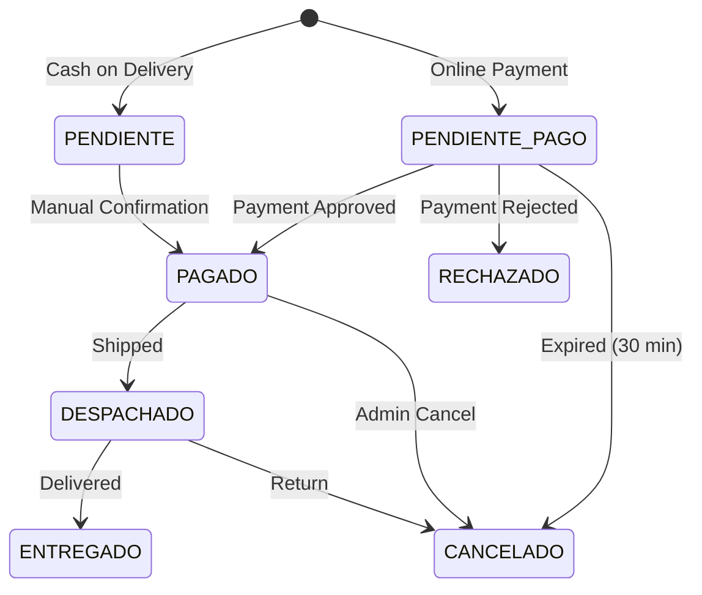

## Overview

Order management Cloud Functions handle the complete order lifecycle from creation through fulfillment. Each payment method creates orders using a standardized structure in the `orders` collection.

## Order Creation Flow

All payment methods follow a consistent order creation pattern:

<Steps>
  <Step title="Validate User Authentication">
    Verify Firebase ID token or auth context
  </Step>
  <Step title="Fetch Real Product Prices">
    Query Firestore `products` collection to prevent price tampering
  </Step>
  <Step title="Create Order Document">
    Save order to `orders/{orderId}` with status `PENDIENTE_PAGO` or `PENDIENTE`
  </Step>
  <Step title="Return Payment Link">
    For online payments, return checkout URL; for COD, return order ID
  </Step>
</Steps>

## Order Document Schema

All orders share this common structure:

```javascript
{
  // Metadata
  source: 'TIENDA_WEB',
  createdAt: Timestamp,
  updatedAt: Timestamp,
  
  // User Information
  userId: 'firebase-uid',
  userEmail: 'customer@example.com',
  userName: 'Juan Pérez',
  phone: '3001234567',
  clientDoc: '1234567890',
  
  // Shipping & Billing
  shippingData: {
    address: 'Calle 123 #45-67',
    city: 'Bogotá',
    department: 'Cundinamarca',
    phone: '3001234567'
  },
  billingData: { /* optional */ },
  requiresInvoice: false,
  
  // Order Items
  items: [
    {
      id: 'product-id',
      name: 'iPhone 14 Pro',
      price: 4500000,
      quantity: 1,
      color: 'negro',
      capacity: '256GB',
      mainImage: 'https://...'
    }
  ],
  
  // Pricing
  subtotal: 4500000,
  shippingCost: 15000,
  total: 4515000,
  
  // Status Management
  status: 'PENDIENTE_PAGO',     // or PAGADO, DESPACHADO, ENTREGADO, CANCELADO
  paymentStatus: 'PENDING',      // or PAID, REJECTED
  paymentMethod: 'MERCADOPAGO',  // or ADDI, SISTECREDITO, CONTRAENTREGA
  
  // Inventory Control
  isStockDeducted: false,
  
  // Payment Details (set by webhook)
  paymentId: 'mp-123456',
  paymentAccountId: 'account-xyz',
  paymentMethodName: 'MercadoPago',
  
  // Shipping (set when dispatched)
  carrier: 'Servientrega',
  trackingNumber: '1234567890',
  
  // Additional
  buyerInfo: { /* legacy field */ },
  notes: 'Customer notes'
}
```

## Order Status Workflow



### Status Definitions

<ParamField body="PENDIENTE_PAGO" type="string">
  Order created, awaiting online payment confirmation. Stock NOT deducted.
</ParamField>

<ParamField body="PENDIENTE" type="string">
  Cash on Delivery order confirmed. Stock IS deducted immediately.
</ParamField>

<ParamField body="PAGADO" type="string">
  Payment confirmed. Stock deducted. Order ready for fulfillment.
</ParamField>

<ParamField body="DESPACHADO" type="string">
  Order shipped with carrier. Tracking number assigned.
</ParamField>

<ParamField body="ENTREGADO" type="string">
  Customer received the order successfully.
</ParamField>

<ParamField body="RECHAZADO" type="string">
  Payment failed or rejected by gateway.
</ParamField>

<ParamField body="CANCELADO" type="string">
  Order cancelled by system (expired) or admin.
</ParamField>

## Inventory Management

### Stock Deduction Logic

From `mercadopago.js:213-239`:

```javascript
if (!oData.isStockDeducted) {
    for(const i of oData.items) {
        const pRef = db.collection('products').doc(i.id);
        const pDoc = await t.get(pRef);
        const pData = pDoc.data();
        
        // Deduct main stock
        let newStock = (pData.stock || 0) - (i.quantity || 1);
        
        // Handle product variants
        let newCombinations = pData.combinations || [];
        if (i.color || i.capacity) {
            const idx = newCombinations.findIndex(c => 
                (c.color === i.color || !c.color) &&
                (c.capacity === i.capacity || !c.capacity)
            );
            if (idx >= 0) {
                newCombinations[idx].stock -= i.quantity;
            }
        }
        
        t.update(pRef, { 
            stock: Math.max(0, newStock), 
            combinations: newCombinations 
        });
    }
}
```

<Warning>
**Variant Stock**: Products with color/capacity combinations have separate stock tracking in the `combinations` array.
</Warning>

### Stock Validation (COD)

Cash on Delivery orders validate stock availability before creation:

```javascript
for (const item of rawItems) {
    const pDoc = await t.get(pRef);
    let newStock = (pData.stock || 0) - qty;
    
    if (newStock < 0) {
        throw new Error(`Sin stock: ${pData.name}`);
    }
}
```

## Order Update Functions

### Payment Confirmation (Webhooks)

When a payment is approved, webhooks perform these actions atomically:

**From `mercadopago.js:204-305`:**

<Steps>
  <Step title="Verify Not Already Paid">
    Check `paymentStatus !== 'PAID'` to prevent duplicate processing
  </Step>
  <Step title="Deduct Inventory">
    Update product stock and variant combinations
  </Step>
  <Step title="Credit Treasury Account">
    Add payment to configured gateway account (e.g., MercadoPago account)
  </Step>
  <Step title="Create Income Record">
    Log transaction in `expenses` collection with type `INCOME`
  </Step>
  <Step title="Generate Remission">
    Create fulfillment document in `remissions` collection
  </Step>
  <Step title="Update Order Status">
    Set status to `PAGADO`, `paymentStatus` to `PAID`, mark `isStockDeducted: true`
  </Step>
</Steps>

**Transaction Example:**
```javascript
await db.runTransaction(async (t) => {
    const orderSnap = await t.get(orderRef);
    const oData = orderSnap.data();
    
    // Prevent duplicate processing
    if (oData.paymentStatus === 'PAID') return;
    
    // 1. Update inventory (see above)
    // 2. Update treasury
    const accSnap = await t.get(
        db.collection('accounts')
          .where('gatewayLink', '==', 'MERCADOPAGO')
          .limit(1)
    );
    const accDoc = accSnap.docs[0];
    t.update(accDoc.ref, {
        balance: (accDoc.data().balance || 0) + oData.total
    });
    
    // 3. Create income record
    const incRef = db.collection('expenses').doc();
    t.set(incRef, {
        amount: oData.total,
        category: "Ingreso Ventas Online",
        description: `Venta MP #${orderId.slice(0,8)}`,
        paymentMethod: accDoc.data().name,
        type: 'INCOME',
        orderId: orderId,
        date: admin.firestore.FieldValue.serverTimestamp()
    });
    
    // 4. Create remission
    const remRef = db.collection('remissions').doc(orderId);
    t.set(remRef, {
        orderId,
        source: 'WEBHOOK_MP',
        items: oData.items,
        clientName: oData.userName,
        clientAddress: `${oData.shippingData.address}, ${oData.shippingData.city}`,
        total: oData.total,
        status: 'PENDIENTE_ALISTAMIENTO',
        type: 'VENTA_WEB',
        createdAt: admin.firestore.FieldValue.serverTimestamp()
    });
    
    // 5. Mark order as paid
    t.update(orderRef, {
        status: 'PAGADO',
        paymentStatus: 'PAID',
        paymentId: paymentId,
        isStockDeducted: true,
        updatedAt: admin.firestore.FieldValue.serverTimestamp()
    });
});
```

## Treasury Integration

### Account Linking

Each payment gateway is linked to a treasury account via the `gatewayLink` field:

```javascript
// Query for MercadoPago account
const accQuery = db.collection('accounts')
    .where('gatewayLink', '==', 'MERCADOPAGO')
    .limit(1);

// Fallback to default online account
if (accQuery.empty) {
    accQuery = db.collection('accounts')
        .where('isDefaultOnline', '==', true)
        .limit(1);
}
```

### Income Recording

All confirmed payments create an income record:

```javascript
{
    amount: 4515000,
    category: "Ingreso Ventas Online",
    description: "Venta MP #ABC12345",
    paymentMethod: "MercadoPago",
    date: Timestamp,
    createdAt: Timestamp,
    type: 'INCOME',
    orderId: 'order-id',
    supplierName: 'Juan Pérez'
}
```

## Remission Generation

When an order is paid, a remission (fulfillment document) is created:

**From `mercadopago.js:286-293`:**

```javascript
const remRef = db.collection('remissions').doc(orderId);
t.set(remRef, {
    orderId: orderId,
    source: 'WEBHOOK_MP',
    items: oData.items,
    clientName: oData.userName,
    clientPhone: oData.phone,
    clientDoc: oData.clientDoc,
    clientAddress: `${oData.shippingData.address}, ${oData.shippingData.city}`,
    total: oData.total,
    status: 'PENDIENTE_ALISTAMIENTO',
    type: 'VENTA_WEB',
    createdAt: admin.firestore.FieldValue.serverTimestamp()
});
```

<Info>
Remissions use the same document ID as the order for easy reference.
</Info>

## Order Cancellation

### Automatic Expiration

The `cancelAbandonedPayments` scheduler cancels unpaid orders after 35 minutes.

**From `scheduler.js:157-211`:**

```javascript
exports.cancelAbandonedPayments = onSchedule({
    schedule: "every 15 minutes"
}, async (event) => {
    const timeout = new Date();
    timeout.setMinutes(timeout.getMinutes() - 35);
    
    const snapshot = await db.collection('orders')
        .where('status', '==', 'PENDIENTE_PAGO')
        .where('createdAt', '<=', admin.firestore.Timestamp.fromDate(timeout))
        .get();
    
    const batch = db.batch();
    snapshot.docs.forEach(doc => {
        if (doc.data().paymentStatus !== 'PAID') {
            batch.update(doc.ref, {
                status: 'CANCELADO',
                statusDetail: 'expired_by_system',
                notes: "[Sistema: Cancelado por inactividad de pago]"
            });
        }
    });
    
    await batch.commit();
});
```

### Manual Cancellation

Admins can manually cancel orders through the admin panel, which should:

1. Update order status to `CANCELADO`
2. Restore inventory if `isStockDeducted === true`
3. Reverse treasury account balance if payment was received

## Order Queries

### Get User's Orders

```javascript
const userOrders = await db.collection('orders')
    .where('userId', '==', userId)
    .orderBy('createdAt', 'desc')
    .get();
```

### Get Pending Orders

```javascript
const pending = await db.collection('orders')
    .where('status', 'in', ['PENDIENTE', 'PAGADO'])
    .orderBy('createdAt', 'asc')
    .get();
```

### Get Orders by Payment Method

```javascript
const mpOrders = await db.collection('orders')
    .where('paymentMethod', '==', 'MERCADOPAGO')
    .where('paymentStatus', '==', 'PAID')
    .get();
```

## Error Handling

### Transaction Failures

```javascript
try {
    await db.runTransaction(async (t) => {
        // Order processing logic
    });
} catch (error) {
    console.error("❌ Order Transaction Failed:", error);
    throw new functions.https.HttpsError('internal', error.message);
}
```

### Stock Validation Errors

```javascript
if (newStock < 0) {
    throw new Error(`Sin stock: ${pData.name}`);
}
```

## Best Practices

<CardGroup cols={2}>
  <Card title="Always Use Transactions" icon="lock">
    Use Firestore transactions for inventory and payment operations to ensure consistency
  </Card>
  <Card title="Validate Prices Server-Side" icon="shield">
    Never trust client-sent prices; always fetch from Firestore
  </Card>
  <Card title="Check isStockDeducted" icon="boxes-stacked">
    Prevent duplicate inventory deductions in webhook handlers
  </Card>
  <Card title="Log All State Changes" icon="file-lines">
    Use `updatedAt` timestamps and status change logging for audit trails
  </Card>
</CardGroup>

## Related Documentation

- [Payment Functions](/api/payments)
- [Email Notifications](/api/emails)
- [Scheduler Functions](/api/scheduler)
- [Collections: Orders](/api/collections/orders)