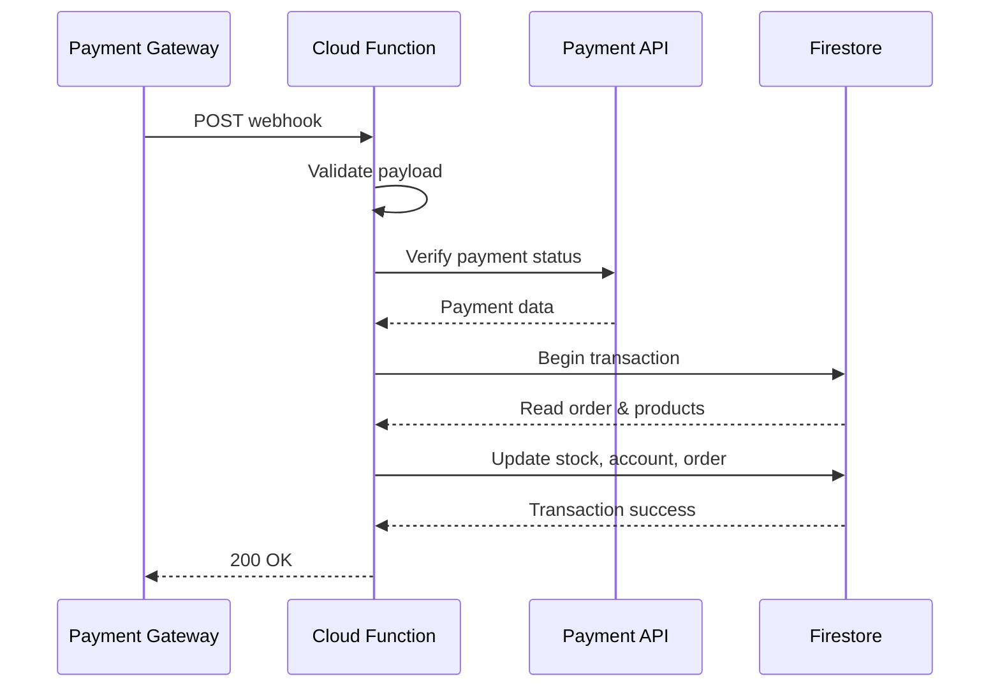

## Overview

PixelTech Colombia receives webhooks from multiple payment gateways and communication platforms. All webhooks are implemented as Firebase Cloud Functions with HTTPS endpoints.

## Webhook Architecture

### Endpoint Pattern

All webhooks follow this URL structure:

```
https://us-central1-pixeltechcol.cloudfunctions.net/{functionName}
```

**Deployed Functions**:
- `mercadoPagoWebhook`
- `addiWebhook` → Deployed to Cloud Run: `https://addiwebhook-muiondpggq-uc.a.run.app`
- `sistecreditoWebhook` → Deployed to Cloud Run: `https://sistecreditowebhook-muiondpggq-uc.a.run.app`
- `whatsappWebhook`

### Common Flow



## MercadoPago Webhook

### Configuration

**Function**: `mercadoPagoWebhook`
**Type**: HTTPS Request
**File**: `functions/mercadopago.js:174`
**Endpoint**: `https://us-central1-pixeltechcol.cloudfunctions.net/mercadoPagoWebhook`

**Registered in**: MercadoPago preference creation (`functions/mercadopago.js:154`)

```javascript
notification_url: "https://us-central1-pixeltechcol.cloudfunctions.net/mercadoPagoWebhook"
```

### Payload Format

MercadoPago sends minimal data in webhook:

```json
{
  "action": "payment.updated",
  "api_version": "v1",
  "data": {
    "id": "1234567890"
  },
  "date_created": "2024-01-15T10:30:00Z",
  "id": 123456,
  "live_mode": true,
  "type": "payment",
  "user_id": "987654321"
}
```

**Alternative formats**:
- Query params: `?id=1234567890&topic=payment`
- Body: `{ "id": "1234567890", "topic": "payment" }`

### Webhook Handler

**Code**: `functions/mercadopago.js:174-326`

#### Step 1: Extract Payment ID

```javascript
const paymentId = req.query.id || 
                   req.query['data.id'] || 
                   req.body?.data?.id || 
                   req.body?.id;

const topic = req.query.topic || req.body?.topic;

// Ignore non-payment notifications
if (topic === 'merchant_order') return res.status(200).send("OK");
if (!paymentId) return res.status(200).send("OK");
```

#### Step 2: Verify Payment Status

**Always verify with API** (never trust webhook payload directly):

```javascript
const payment = new Payment(client);
const paymentData = await payment.get({ id: paymentId });

const status = paymentData.status; // 'approved', 'rejected', 'pending', etc.
const orderId = paymentData.external_reference;
```

**Why verify?** Webhooks can be spoofed. Always confirm with the payment gateway API.

#### Step 3: Process Payment (Approved)

**Code**: `functions/mercadopago.js:204-306`

```javascript
if (status === 'approved') {
    await db.runTransaction(async (t) => {
        const docSnap = await t.get(orderRef);
        
        // Duplicate prevention
        if (docSnap.data().status === 'PAGADO') return;
        
        const oData = docSnap.data();
        
        // 1. Deduct inventory
        for (const item of oData.items) {
            const pDoc = await t.get(productRef);
            const pData = pDoc.data();
            
            let newStock = pData.stock - item.quantity;
            
            // Handle variants
            if (item.color || item.capacity) {
                const idx = combinations.findIndex(c => 
                    c.color === item.color && c.capacity === item.capacity
                );
                combinations[idx].stock -= item.quantity;
            }
            
            t.update(productRef, { 
                stock: newStock, 
                combinations: combinations 
            });
        }
        
        // 2. Update treasury account
        const accQuery = await t.get(
            db.collection('accounts')
              .where('gatewayLink', '==', 'MERCADOPAGO')
              .limit(1)
        );
        
        if (!accQuery.empty) {
            const accDoc = accQuery.docs[0];
            const currentBalance = accDoc.data().balance;
            
            t.update(accDoc.ref, { 
                balance: currentBalance + oData.total 
            });
            
            // 3. Create income record
            t.set(db.collection('expenses').doc(), {
                amount: oData.total,
                category: "Ingreso Ventas Online",
                description: `Venta MP #${orderId.slice(0,8)}`,
                paymentMethod: accDoc.data().name,
                type: 'INCOME',
                orderId: orderId,
                supplierName: oData.userName,
                date: serverTimestamp(),
                createdAt: serverTimestamp()
            });
        }
        
        // 4. Create remission (picking document)
        t.set(db.collection('remissions').doc(orderId), {
            orderId,
            source: 'WEBHOOK_MP',
            items: oData.items,
            clientName: oData.userName,
            clientPhone: oData.phone,
            clientAddress: `${oData.shippingData.address}, ${oData.shippingData.city}`,
            total: oData.total,
            status: 'PENDIENTE_ALISTAMIENTO',
            type: 'VENTA_WEB',
            createdAt: serverTimestamp()
        });
        
        // 5. Update order status
        t.update(orderRef, {
            status: 'PAGADO',
            paymentStatus: 'PAID',
            paymentId: paymentId,
            isStockDeducted: true,
            updatedAt: serverTimestamp()
        });
    });
}
```

#### Step 4: Handle Rejection

```javascript
else if (status === 'rejected' || status === 'cancelled') {
    await orderRef.update({
        status: 'RECHAZADO',
        paymentId: paymentId,
        statusDetail: paymentData.status_detail,
        updatedAt: serverTimestamp()
    });
}
```

### Testing MercadoPago Webhook

#### Local Testing with Emulator

```bash
# Start emulator
firebase emulators:start

# Send test webhook
curl -X POST http://localhost:5001/pixeltechcol/us-central1/mercadoPagoWebhook \
  -H "Content-Type: application/json" \
  -d '{"id": "test_payment_123", "topic": "payment"}'
```

#### Production Testing

Use MercadoPago's Sandbox mode:

```javascript
const client = new MercadoPagoConfig({ 
    accessToken: TEST_ACCESS_TOKEN,
    options: { timeout: 5000 }
});
```

**Test Cards**:
- **Approved**: 4170 0688 1010 8020 (VISA)
- **Rejected**: 4013 5406 8274 6260 (VISA)

## ADDI Webhook

### Configuration

**Function**: `addiWebhook`
**Type**: HTTPS Request with CORS
**File**: `functions/addi.js:260`
**Endpoint**: `https://addiwebhook-muiondpggq-uc.a.run.app`

**Registered in**: Checkout creation (`functions/addi.js:216`)

```javascript
allyUrlRedirection: {
    callbackUrl: "https://addiwebhook-muiondpggq-uc.a.run.app"
}
```

### Payload Format

```json
{
  "orderId": "firebase_order_id",
  "applicationId": "addi_application_123",
  "status": "APPROVED",
  "totalAmount": "150000",
  "currency": "COP"
}
```

**Status Values**:
- `APPROVED` / `COMPLETED`: Payment successful
- `REJECTED` / `DECLINED` / `ABANDONED`: Payment failed

### Webhook Handler

**Code**: `functions/addi.js:260-376`

```javascript
exports.webhook = async (req, res) => {
    return cors(req, res, async () => {
        const body = req.body;
        const orderId = body.orderId;
        const status = body.status;
        
        if (status === 'APPROVED' || status === 'COMPLETED') {
            await db.runTransaction(async (t) => {
                const docSnap = await t.get(orderRef);
                
                // 🚨 CRITICAL: Duplicate prevention
                if (docSnap.data().paymentStatus === 'PAID') {
                    console.log('Webhook duplicado ignorado');
                    return;
                }
                
                // ... same logic as MercadoPago
                // 1. Deduct stock
                // 2. Update treasury
                // 3. Create remission
                // 4. Mark as paid
            });
        }
        
        res.status(200).send("OK");
    });
};
```

**Key Difference from MercadoPago**: 
- ADDI sends full order data in webhook (no API verification needed)
- CORS enabled (ADDI makes cross-origin requests)
- Uses `paymentStatus` check instead of `status` for duplicate prevention

### Duplicate Prevention

**Problem**: ADDI sometimes sends multiple webhooks for the same payment.

**Solution** (`functions/addi.js:281-284`):

```javascript
if (oData.paymentStatus === 'PAID' || oData.status === 'PAGADO') {
    console.log(`⚠️ Webhook duplicado ignorado. Orden ${orderId} ya pagada.`);
    return; // Exit transaction without changes
}
```

**Why both checks?**
- `paymentStatus`: Financial state (always set first)
- `status`: Logistics state (might be updated later)

### Testing ADDI Webhook

```bash
curl -X POST https://addiwebhook-muiondpggq-uc.a.run.app \
  -H "Content-Type: application/json" \
  -H "Origin: https://addi.com" \
  -d '{
    "orderId": "test_order_123",
    "applicationId": "addi_test_456",
    "status": "APPROVED",
    "totalAmount": "100000"
  }'
```

## Sistecrédito Webhook

### Configuration

**Function**: `sistecreditoWebhook`
**Type**: HTTPS Request with CORS
**File**: `functions/sistecredito.js:172`
**Endpoint**: `https://sistecreditowebhook-muiondpggq-uc.a.run.app`

**Registered in**: Checkout creation (`functions/sistecredito.js:127`)

```javascript
urlConfirmation: "https://sistecreditowebhook-muiondpggq-uc.a.run.app",
methodConfirmation: "POST"
```

### Payload Format

```json
{
  "data": {
    "invoice": "firebase_order_id",
    "transactionStatus": "Approved",
    "_id": "sc_transaction_123",
    "value": 150000,
    "currency": "COP"
  }
}
```

**Status Values**:
- `Approved`: Payment successful
- `Rejected` / `Cancelled` / `Failed`: Payment failed

### Webhook Handler

**Code**: `functions/sistecredito.js:172-289`

```javascript
exports.webhook = async (req, res) => {
    return cors(req, res, async () => {
        const body = req.body;
        const txData = body.data || body;
        const orderId = txData.invoice;
        const status = txData.transactionStatus;
        
        if (status === 'Approved') {
            await db.runTransaction(async (t) => {
                // Duplicate check
                if (oData.paymentStatus === 'PAID') {
                    console.log('Webhook duplicado ignorado');
                    return;
                }
                
                // ... same logic as other webhooks
            });
        }
        
        res.status(200).send("OK");
    });
};
```

**Identical Logic**: Uses the same inventory/treasury flow as ADDI and MercadoPago.

### Testing Sistecrédito Webhook

```bash
curl -X POST https://sistecreditowebhook-muiondpggq-uc.a.run.app \
  -H "Content-Type: application/json" \
  -d '{
    "data": {
      "invoice": "test_order_123",
      "transactionStatus": "Approved",
      "_id": "sc_test_789",
      "value": 100000
    }
  }'
```

## WhatsApp Webhook

### Configuration

**Function**: `whatsappWebhook`
**Type**: HTTPS Request
**File**: `functions/whatsapp.js:65`
**Endpoint**: `https://us-central1-pixeltechcol.cloudfunctions.net/whatsappWebhook`

**Registered in**: Meta Developer Portal (WhatsApp Business API settings)

### Verification Request

Meta sends GET request to verify webhook:

```http
GET /whatsappWebhook?hub.mode=subscribe&hub.verify_token=YOUR_TOKEN&hub.challenge=CHALLENGE_STRING
```

**Handler** (`functions/whatsapp.js:67-72`):

```javascript
if (req.method === "GET") {
    if (req.query["hub.mode"] === "subscribe" && 
        req.query["hub.verify_token"] === VERIFY_TOKEN) {
        res.status(200).send(req.query["hub.challenge"]);
    } else {
        res.sendStatus(403);
    }
    return;
}
```

### Message Payload

```json
{
  "object": "whatsapp_business_account",
  "entry": [{
    "id": "BUSINESS_ID",
    "changes": [{
      "value": {
        "messaging_product": "whatsapp",
        "messages": [{
          "from": "573001234567",
          "id": "wamid.ABC123",
          "timestamp": "1673456789",
          "type": "text",
          "text": {
            "body": "Hola, ¿tienen iPhone 15?"
          }
        }],
        "contacts": [{
          "profile": {
            "name": "Juan Pérez"
          },
          "wa_id": "573001234567"
        }]
      },
      "field": "messages"
    }]
  }]
}
```

### Message Handler

**Code**: `functions/whatsapp.js:75-173`

```javascript
if (req.method === "POST") {
    const message = body.entry[0].changes[0].value.messages[0];
    const phoneNumber = message.from;
    const userName = body.entry[0].changes[0].value.contacts[0].profile.name;
    const type = message.type;
    
    let content = "";
    let mediaUrl = null;
    
    // Process message type
    if (type === "text") {
        content = message.text.body;
    } 
    else if (type === "image") {
        content = message.image.caption || "📷 Imagen recibida";
        mediaUrl = await downloadAndUploadMedia(
            message.image.id, 
            message.image.mime_type, 
            phoneNumber
        );
    }
    
    // Save to Firestore
    const chatRef = db.collection('chats').doc(phoneNumber);
    
    await chatRef.set({
        clientName: userName,
        phoneNumber,
        lastMessage: content,
        lastMessageAt: serverTimestamp(),
        unread: true,
        platform: 'whatsapp',
        status: 'open'
    }, { merge: true });
    
    await chatRef.collection('messages').add({
        type: 'incoming',
        content: content,
        mediaUrl: mediaUrl,
        messageType: type,
        whatsappId: message.id,
        timestamp: serverTimestamp()
    });
    
    res.sendStatus(200);
}
```

### Auto-Reply Bot

**Code**: `functions/whatsapp.js:100-136`

**Active Hours**: 8 PM to 7 AM (Colombia time)
**Cooldown**: 12 hours between auto-replies

```javascript
const now = new Date();
const bogotaHour = parseInt(now.toLocaleString("en-US", {
    timeZone: "America/Bogota",
    hour: "numeric",
    hour12: false
}));

const isOutOfOffice = bogotaHour >= 20 || bogotaHour < 7;

if (isOutOfOffice) {
    const lastAutoReply = chatDoc.data().lastAutoReply?.toDate();
    const hoursSinceLast = lastAutoReply ? 
        (now - lastAutoReply) / (1000 * 60 * 60) : 24;
    
    if (hoursSinceLast > 12) {
        const replyText = "Hola 👋, gracias por escribir a PixelTech.\n\n" +
                         "🌙 Nuestro equipo descansa en este momento, " +
                         "pero hemos recibido tu mensaje y te responderemos " +
                         "a primera hora de la mañana.";
        
        await sendToMeta(phoneNumber, replyText, 'text');
        
        await chatRef.update({
            lastAutoReply: serverTimestamp()
        });
    }
}
```

### Media Download

**Helper** (`functions/whatsapp.js:40-62`):

```javascript
async function downloadAndUploadMedia(mediaId, mimeType, phoneNumber) {
    // 1. Get media URL from Meta API
    const metaRes = await axios.get(
        `https://graph.facebook.com/v17.0/${mediaId}`,
        { headers: { 'Authorization': `Bearer ${API_TOKEN}` }}
    );
    
    // 2. Download media file
    const fileRes = await axios.get(metaRes.data.url, {
        responseType: 'arraybuffer',
        headers: { 'Authorization': `Bearer ${API_TOKEN}` }
    });
    
    // 3. Upload to Firebase Storage
    const ext = mimeType.split('/')[1];
    const fileName = `chats/${phoneNumber}/${Date.now()}_${mediaId}.${ext}`;
    const file = storage.bucket().file(fileName);
    
    await file.save(fileRes.data, { 
        metadata: { contentType: mimeType } 
    });
    await file.makePublic();
    
    return file.publicUrl();
}
```

### Testing WhatsApp Webhook

#### Verification Test

```bash
curl -X GET "https://us-central1-pixeltechcol.cloudfunctions.net/whatsappWebhook?hub.mode=subscribe&hub.verify_token=YOUR_TOKEN&hub.challenge=TEST123"
# Should return: TEST123
```

#### Message Test

```bash
curl -X POST https://us-central1-pixeltechcol.cloudfunctions.net/whatsappWebhook \
  -H "Content-Type: application/json" \
  -d '{
    "object": "whatsapp_business_account",
    "entry": [{
      "changes": [{
        "value": {
          "messages": [{
            "from": "573001234567",
            "id": "test123",
            "type": "text",
            "text": { "body": "Test message" }
          }],
          "contacts": [{
            "profile": { "name": "Test User" },
            "wa_id": "573001234567"
          }]
        }
      }]
    }]
  }'
```

## Webhook Security

### 1. Verify Payment Status

**Always verify with gateway API** (MercadoPago example):

```javascript
// ❌ INSECURE: Trust webhook payload
if (req.body.status === 'approved') {
    // Process payment
}

// ✅ SECURE: Verify with API
const payment = await paymentAPI.get(paymentId);
if (payment.status === 'approved') {
    // Process payment
}
```

### 2. Idempotency

**Prevent duplicate processing** with transaction checks:

```javascript
await db.runTransaction(async (t) => {
    const order = await t.get(orderRef);
    
    if (order.data().paymentStatus === 'PAID') {
        console.log('Already processed');
        return; // Exit safely
    }
    
    // Process payment...
});
```

### 3. Signature Verification

**WhatsApp Example** (if Meta sends signature):

```javascript
const crypto = require('crypto');

function verifyWebhookSignature(payload, signature) {
    const expectedSignature = crypto
        .createHmac('sha256', APP_SECRET)
        .update(payload)
        .digest('hex');
    
    return signature === expectedSignature;
}

// In webhook handler
const signature = req.headers['x-hub-signature-256'];
if (!verifyWebhookSignature(req.rawBody, signature)) {
    return res.sendStatus(403);
}
```

### 4. Rate Limiting

**Firebase Hosting rewrites** with rate limits:

```json
{
  "hosting": {
    "rewrites": [{
      "source": "/webhooks/mercadopago",
      "function": "mercadoPagoWebhook",
      "region": "us-central1"
    }],
    "headers": [{
      "source": "/webhooks/**",
      "headers": [{
        "key": "X-Content-Type-Options",
        "value": "nosniff"
      }]
    }]
  }
}
```

**Cloud Armor** (for Cloud Run functions):

```bash
gcloud compute security-policies create webhook-policy \
    --description "Rate limit webhooks"

gcloud compute security-policies rules create 1000 \
    --security-policy webhook-policy \
    --expression "origin.region_code == 'CO'" \
    --action "rate-based-ban" \
    --rate-limit-threshold-count 100 \
    --rate-limit-threshold-interval-sec 60
```

## Monitoring & Debugging

### Cloud Functions Logs

```bash
# View logs
firebase functions:log

# Filter by function
firebase functions:log --only mercadoPagoWebhook

# Real-time logs
gcloud functions logs read mercadoPagoWebhook --limit 50 --follow
```

### Webhook Debugging

**Add detailed logging** in handlers:

```javascript
exports.webhook = async (req, res) => {
    console.log('🔔 Webhook received:', {
        method: req.method,
        headers: req.headers,
        query: req.query,
        body: req.body
    });
    
    try {
        // Process webhook...
        console.log('✅ Webhook processed successfully');
    } catch (error) {
        console.error('❌ Webhook error:', {
            message: error.message,
            stack: error.stack
        });
    }
    
    res.status(200).send('OK');
};
```

### Webhook Testing Tools

**Webhook.site**: Create temporary endpoint

```bash
# 1. Go to https://webhook.site
# 2. Copy your unique URL
# 3. Configure in payment gateway
# 4. View incoming webhooks in real-time
```

**ngrok**: Tunnel to localhost

```bash
# Start local emulator
firebase emulators:start

# Tunnel port 5001
ngrok http 5001

# Use ngrok URL in webhook config
https://abc123.ngrok.io/pixeltechcol/us-central1/mercadoPagoWebhook
```

## Error Handling

### Retry Logic

Most payment gateways retry webhooks on failure:

- **MercadoPago**: Retries up to 12 times over 48 hours
- **ADDI**: Retries up to 5 times over 24 hours
- **Sistecrédito**: Retries up to 3 times over 6 hours

**Always return 200 OK** to prevent retries:

```javascript
try {
    // Process webhook
    res.status(200).send('OK');
} catch (error) {
    console.error('Error:', error);
    // Still return 200 to prevent retry loop
    res.status(200).send('Error logged');
}
```

### Dead Letter Queue

**Store failed webhooks** for manual review:

```javascript
try {
    // Process payment
} catch (error) {
    await db.collection('webhook_failures').add({
        source: 'MERCADOPAGO',
        paymentId: paymentId,
        error: error.message,
        payload: req.body,
        timestamp: serverTimestamp()
    });
    
    res.status(200).send('Error logged');
}
```

## Best Practices

1. **Always return 200 OK** (even on errors) to prevent retry storms
2. **Verify payment status** with gateway API (never trust webhook payload alone)
3. **Use transactions** for database updates (prevent partial updates)
4. **Check for duplicates** before processing (idempotency)
5. **Log everything** (webhooks are hard to debug)
6. **Test with real webhooks** (emulator behavior differs from production)
7. **Monitor failure rates** (set up alerts for over 5% failures)
8. **Keep handlers fast** (under 10 seconds execution time)
9. **Use Cloud Run** for CORS-enabled webhooks (ADDI, Sistecrédito)
10. **Document payload formats** (payment gateways change without notice)