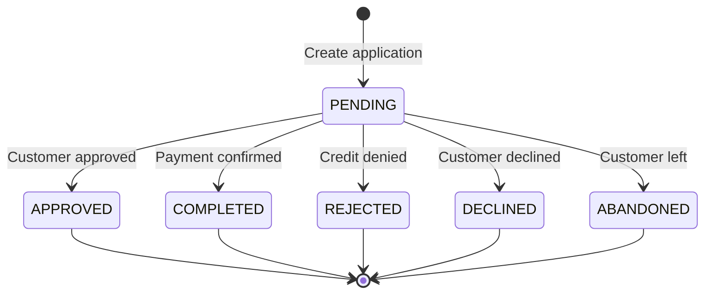

## Overview

ADDI is a buy now, pay later (BNPL) platform that allows customers to split payments into installments. This integration provides seamless checkout and automatic payment tracking.

<Info>ADDI offers flexible payment terms, making high-value purchases more accessible to customers.</Info>

## Prerequisites

<Card title="Required Credentials" icon="key">
  - ADDI merchant account
  - Client ID
  - Client Secret
  - Webhook URL configured
</Card>

## Configuration

### Environment Variables

Add these to your Firebase Functions configuration:

```bash
ADDI_CLIENT_ID=your_addi_client_id
ADDI_CLIENT_SECRET=your_addi_client_secret
```

### Code Configuration

From `~/workspace/source/functions/addi.js:10-24`:

```javascript
const IS_SANDBOX = false; // Set to true for testing

const ADDI_BASE_URL = IS_SANDBOX
    ? "https://api.addi-staging.com"
    : "https://api.addi.com";

const ADDI_AUTH_URL = "https://auth.addi.com";
const ADDI_AUDIENCE = "https://api.addi.com";

const ADDI_CLIENT_ID = process.env.ADDI_CLIENT_ID;
const ADDI_CLIENT_SECRET = process.env.ADDI_CLIENT_SECRET;
const WEBHOOK_URL = "https://addiwebhook-muiondpggq-uc.a.run.app";
```

## Authentication

ADDI uses OAuth 2.0 client credentials flow.

### Get Access Token

From `~/workspace/source/functions/addi.js:28-54`:

```javascript
async function getAddiToken() {
  try {
    console.log(`🔐 Requesting Token (${IS_SANDBOX ? 'SANDBOX' : 'PROD'})...`);

    if (!ADDI_CLIENT_ID || !ADDI_CLIENT_SECRET) {
      throw new Error("ADDI credentials missing.");
    }

    const response = await axios({
      method: 'post',
      url: `${ADDI_AUTH_URL}/oauth/token`,
      data: {
        client_id: ADDI_CLIENT_ID.trim(),
        client_secret: ADDI_CLIENT_SECRET.trim(),
        audience: ADDI_AUDIENCE,
        grant_type: "client_credentials"
      },
      headers: { 'Content-Type': 'application/json' }
    });

    return response.data.access_token;
  } catch (error) {
    console.error("❌ Auth Error:", error.response?.data || error.message);
    throw new Error("Error autenticando con ADDI");
  }
}
```

## Creating ADDI Checkout

### Function: `createAddiCheckout`

Creates an ADDI financing application.

### Parameters

<ParamField path="userToken" type="string">
  Firebase authentication token
</ParamField>

<ParamField path="items" type="array" required>
  Array of cart items with product IDs from Firestore
</ParamField>

<ParamField path="shippingCost" type="number" default="0">
  Shipping cost in COP
</ParamField>

<ParamField path="buyerInfo" type="object" required>
  Customer information
  
  <Expandable title="Buyer properties">
    <ResponseField name="name" type="string" required>
      Customer full name
    </ResponseField>
    <ResponseField name="document" type="string" required>
      Colombian ID number (Cédula)
    </ResponseField>
    <ResponseField name="phone" type="string" required>
      Colombian mobile number
    </ResponseField>
    <ResponseField name="address" type="string" required>
      Street address
    </ResponseField>
    <ResponseField name="city" type="string" required>
      City name
    </ResponseField>
    <ResponseField name="department" type="string">
      Department/State
    </ResponseField>
  </Expandable>
</ParamField>

<ParamField path="extraData" type="object">
  Additional order information
</ParamField>

### Example Request

```javascript
const createAddiCheckout = firebase.functions().httpsCallable('createAddiCheckout');

const result = await createAddiCheckout({
  userToken: await firebase.auth().currentUser.getIdToken(),
  items: [
    {
      id: 'prod_123',
      quantity: 1,
      color: 'Negro',
      capacity: '256GB'
    }
  ],
  shippingCost: 20000,
  buyerInfo: {
    name: 'María González',
    document: '1234567890',
    phone: '3001234567',
    address: 'Carrera 45 #67-89',
    city: 'Medellín',
    department: 'Antioquia'
  },
  extraData: {
    needsInvoice: false
  }
});

console.log(result.data);
// { initPoint: 'https://api.addi.com/v1/online-applications/...' }
```

### Response

<ResponseField name="initPoint" type="string">
  ADDI application URL to redirect the customer
</ResponseField>

## Implementation Flow

From `~/workspace/source/functions/addi.js:59-252`:

### 1. Authenticate User

```javascript
const userToken = data.userToken;
let uid, email;

if (userToken) {
  const decoded = await auth.verifyIdToken(userToken);
  uid = decoded.uid;
  email = decoded.email;
} else if (context.auth) {
  uid = context.auth.uid;
  email = context.auth.token.email;
} else {
  throw new Error("User auth failed");
}
```

### 2. Build Items and Calculate Total

```javascript
let dbItems = [];
let subtotal = 0;

const removeAccents = (str) => 
  str ? str.normalize("NFD").replace(/[\u0300-\u036f]/g, "") : "";

for (const item of rawItems) {
  const pDoc = await db.collection('products').doc(item.id).get();
  if (!pDoc.exists) continue;
  
  const pData = pDoc.data();
  const price = Number(pData.price) || 0;
  const qty = parseInt(item.quantity) || 1;
  subtotal += price * qty;

  dbItems.push({
    id: item.id,
    name: pData.name,
    price: price,
    quantity: qty,
    color: item.color || "",
    capacity: item.capacity || "",
    mainImage: pData.mainImage || pData.image || "https://pixeltechcol.com/img/logo.png"
  });
}

const totalAmount = subtotal + shippingCost;
```

### 3. Create Order in Firestore

```javascript
const newOrderRef = db.collection('orders').doc();
const firebaseOrderId = newOrderRef.id;

await newOrderRef.set({
  source: 'TIENDA_WEB',
  createdAt: admin.firestore.FieldValue.serverTimestamp(),
  userId: uid,
  userEmail: email,
  userName: clientName,
  phone: clientPhone,
  clientDoc: clientDoc,
  shippingData: shippingData,
  items: dbItems,
  subtotal: subtotal,
  shippingCost: shippingCost,
  total: totalAmount,
  status: 'PENDIENTE_PAGO',
  paymentMethod: 'ADDI',
  paymentStatus: 'PENDING',
  isStockDeducted: false
});
```

### 4. Prepare ADDI Payload

Data cleaning for ADDI API requirements:

```javascript
// Clean document number
const cleanDoc = String(clientDoc).replace(/\D/g, '');

// Parse name
const fullNameParts = String(clientName).trim().split(" ");
const firstName = fullNameParts[0];
const lastName = fullNameParts.slice(1).join(" ") || "Apellido";

// Format phone number
let rawPhone = String(clientPhone).replace(/\D/g, '');
let cellNumber = rawPhone.startsWith('57') ? rawPhone.substring(2) : rawPhone;
if (!cellNumber) cellNumber = "3000000000";

// Clean city name
let cleanCity = removeAccents(shippingData.city || "Bogota").trim();
if (cleanCity.toLowerCase().includes("bogota")) cleanCity = "Bogota D.C";

const addressObj = {
  lineOne: removeAccents(String(shippingData.address || "Direccion")).substring(0, 60),
  city: cleanCity,
  country: "CO"
};
```

### 5. Create ADDI Application

From `~/workspace/source/functions/addi.js:185-251`:

```javascript
const addiToken = await getAddiToken();

const addiPayload = {
  orderId: firebaseOrderId,
  totalAmount: totalAmount.toFixed(1),
  shippingAmount: shippingCost.toFixed(1),
  totalTaxesAmount: "0.0",
  currency: "COP",
  items: dbItems.map(i => ({
    sku: i.id.substring(0, 50),
    name: removeAccents(i.name).substring(0, 50),
    quantity: String(i.quantity),
    unitPrice: Math.round(i.price),
    tax: 0,
    pictureUrl: i.mainImage || i.image,
    category: "technology",
    brand: "PixelTech"
  })),
  client: {
    idType: "CC",
    idNumber: cleanDoc || "11111111",
    firstName: removeAccents(firstName).substring(0, 50),
    lastName: removeAccents(lastName).substring(0, 50),
    email: String(email).trim().toLowerCase(),
    cellphone: cellNumber,
    cellphoneCountryCode: "+57",
    address: addressObj
  },
  shippingAddress: addressObj,
  billingAddress: addressObj,
  allyUrlRedirection: {
    logoUrl: "https://pixeltechcol.com/img/logo.png",
    callbackUrl: WEBHOOK_URL,
    redirectionUrl: `https://pixeltechcol.com/shop/success.html?order=${firebaseOrderId}`
  }
};

const response = await axios.post(
  `${ADDI_BASE_URL}/v1/online-applications`,
  addiPayload,
  {
    headers: {
      'Authorization': `Bearer ${addiToken}`,
      'Content-Type': 'application/json',
      'User-Agent': 'PixelTechStore/1.0'
    },
    maxRedirects: 0,
    validateStatus: status => status >= 200 && status < 400
  }
);

// Extract redirect URL
let redirectUrl = null;
if (response.status === 301 || response.status === 302) {
  redirectUrl = response.headers.location || response.headers.Location;
} else if (response.data) {
  redirectUrl = response.data.redirectionUrl ||
    response.data.applicationUrl ||
    response.data._links?.webRedirect?.href;
}

if (!redirectUrl) throw new Error("ADDI no devolvió URL.");

return { initPoint: redirectUrl };
```

## Webhook Handling

### Function: `webhook`

Processes ADDI payment notifications.

From `~/workspace/source/functions/addi.js:260-376`:

### Webhook Payload

ADDI sends POST requests with:

```json
{
  "orderId": "firebase_order_id",
  "status": "APPROVED" | "COMPLETED" | "REJECTED" | "DECLINED" | "ABANDONED",
  "applicationId": "addi_application_id"
}
```

### Processing Approved Payments

```javascript
if (status === 'APPROVED' || status === 'COMPLETED') {
  await db.runTransaction(async (t) => {
    const docSnap = await t.get(orderRef);
    if (!docSnap.exists) return;
    
    const oData = docSnap.data();
    
    // Prevent duplicate processing
    if (oData.paymentStatus === 'PAID' || oData.status === 'PAGADO') {
      console.log(`⚠️ Webhook duplicado ignorado. La orden ${orderId} ya estaba pagada.`);
      return;
    }
    
    // 1. Deduct stock
    const prodReads = [];
    if (!oData.isStockDeducted) {
      for (const i of oData.items) {
        const pRef = db.collection('products').doc(i.id);
        const pDoc = await t.get(pRef);
        
        if (pDoc.exists) {
          const pData = pDoc.data();
          let newStock = (pData.stock || 0) - (i.quantity || 1);
          let combinations = pData.combinations || [];
          
          // Handle variants
          if (i.color || i.capacity) {
            const idx = combinations.findIndex(c =>
              (c.color === i.color || (!c.color && !i.color)) &&
              (c.capacity === i.capacity || (!c.capacity && !i.capacity))
            );
            if (idx >= 0) {
              combinations[idx].stock = Math.max(0, combinations[idx].stock - i.quantity);
            }
          }
          
          prodReads.push({ 
            ref: pRef, 
            stock: Math.max(0, newStock), 
            combos: combinations 
          });
        }
      }
    }
    
    // 2. Update treasury
    const accQ = await t.get(
      db.collection('accounts')
        .where('gatewayLink', '==', 'ADDI')
        .limit(1)
    );
    
    let accDoc = (!accQ.empty) ? accQ.docs[0] : null;
    
    if (!accDoc) {
      const defQ = await t.get(
        db.collection('accounts')
          .where('isDefaultOnline', '==', true)
          .limit(1)
      );
      if (!defQ.empty) accDoc = defQ.docs[0];
    }
    
    if (accDoc) {
      t.update(accDoc.ref, { 
        balance: (Number(accDoc.data().balance) || 0) + Number(oData.total)
      });
      
      const incRef = db.collection('expenses').doc();
      t.set(incRef, {
        amount: Number(oData.total),
        category: "Ingreso Ventas Online",
        description: `Venta ADDI #${orderId.slice(0, 8)}`,
        paymentMethod: accDoc.data().name,
        date: admin.firestore.FieldValue.serverTimestamp(),
        type: 'INCOME',
        orderId: orderId,
        supplierName: oData.userName
      });
    }
    
    // 3. Apply stock updates
    for (const p of prodReads) {
      t.update(p.ref, { stock: p.stock, combinations: p.combos });
    }
    
    // 4. Create remission (check if exists first)
    const remRef = db.collection('remissions').doc(orderId);
    const remSnap = await t.get(remRef);
    
    if (!remSnap.exists) {
      t.set(remRef, {
        orderId,
        source: 'WEBHOOK_ADDI',
        items: oData.items,
        clientName: oData.userName,
        clientPhone: oData.phone,
        clientDoc: oData.clientDoc,
        clientAddress: `${oData.shippingData?.address}, ${oData.shippingData?.city}`,
        total: oData.total,
        status: 'PENDIENTE_ALISTAMIENTO',
        type: 'VENTA_WEB',
        createdAt: admin.firestore.FieldValue.serverTimestamp()
      });
    }
    
    // 5. Update order
    t.update(orderRef, {
      status: 'PAGADO',
      paymentStatus: 'PAID',
      paymentId: body.applicationId || 'ADDI',
      updatedAt: admin.firestore.FieldValue.serverTimestamp(),
      isStockDeducted: true
    });
  });
}
```

### Handling Rejected Applications

```javascript
else if (status === 'REJECTED' || status === 'DECLINED' || status === 'ABANDONED') {
  const docCheck = await orderRef.get();
  
  if (docCheck.exists && docCheck.data().paymentStatus !== 'PAID') {
    await orderRef.update({
      status: 'RECHAZADO',
      statusDetail: status
    });
    console.log("❌ Orden Rechazada por ADDI");
  }
}
```

## ADDI Status Flow



## ADDI Status Codes

| Status | Description | Action |
|--------|-------------|--------|
| `PENDING` | Application submitted | Wait for customer |
| `APPROVED` | Credit approved | Process payment |
| `COMPLETED` | Payment completed | Process payment |
| `REJECTED` | Credit denied | Mark as RECHAZADO |
| `DECLINED` | Customer declined | Mark as RECHAZADO |
| `ABANDONED` | Customer left checkout | Mark as RECHAZADO |

## Data Sanitization

ADDI requires clean data. The integration removes accents and validates formats:

### Remove Accents

```javascript
const removeAccents = (str) => 
  str ? str.normalize("NFD").replace(/[\u0300-\u036f]/g, "") : "";
```

### City Name Handling

```javascript
let cleanCity = removeAccents(shippingData.city || "Bogota").trim();
if (cleanCity.toLowerCase().includes("bogota")) {
  cleanCity = "Bogota D.C";
}
```

### Phone Number Formatting

```javascript
let rawPhone = String(clientPhone).replace(/\D/g, '');
let cellNumber = rawPhone.startsWith('57') ? rawPhone.substring(2) : rawPhone;
if (!cellNumber) cellNumber = "3000000000"; // Fallback
```

## Testing

### Sandbox Mode

Enable sandbox in configuration:

```javascript
const IS_SANDBOX = true;
const ADDI_BASE_URL = "https://api.addi-staging.com";
```

### Test Flow

1. Create checkout with valid test data
2. Complete ADDI application in staging environment
3. ADDI will send webhook notification
4. Verify order status updates
5. Check stock deduction
6. Confirm treasury update

### Test Customer Data

```javascript
{
  name: "Test User",
  document: "1234567890",
  phone: "3001234567",
  email: "test@example.com",
  address: "Calle 123",
  city: "Bogota"
}
```

## Treasury Configuration

Create an ADDI treasury account:

```javascript
// Firestore: accounts collection
{
  name: "ADDI",
  gatewayLink: "ADDI",
  balance: 0,
  isDefaultOnline: false,
  type: "ONLINE_PAYMENT"
}
```

## Error Handling

<AccordionGroup>
  <Accordion title="ADDI credentials missing">
    **Cause:** Environment variables not set
    
    **Solution:**
    ```bash
    firebase functions:config:set addi.client_id="YOUR_ID"
    firebase functions:config:set addi.client_secret="YOUR_SECRET"
    ```
  </Accordion>

  <Accordion title="Error autenticando con ADDI">
    **Cause:** Invalid credentials or OAuth error
    
    **Solution:** Verify credentials in ADDI dashboard
  </Accordion>

  <Accordion title="ADDI no devolvió URL">
    **Cause:** Invalid payload or API error
    
    **Solution:** Check logs for ADDI API response details
  </Accordion>

  <Accordion title="Duplicate webhook processing">
    **Cause:** ADDI sent multiple notifications
    
    **Solution:** Already handled - system checks `paymentStatus === 'PAID'`
  </Accordion>
</AccordionGroup>

## Best Practices

<Check>**Clean data** - Always remove accents and special characters</Check>
<Check>**Validate documents** - Ensure Colombian ID format</Check>
<Check>**Handle retries** - ADDI may retry webhooks</Check>
<Check>**Log everything** - Track application IDs for support</Check>
<Check>**Test thoroughly** - Use sandbox before production</Check>

## Next Steps

<CardGroup cols={2}>
  <Card title="MercadoPago Integration" icon="circle-dollar" href="/integrations/mercadopago">
    Add credit card payments
  </Card>
  <Card title="Sistecrédito" icon="building-columns" href="/integrations/sistecredito">
    Add another financing option
  </Card>
  <Card title="Treasury Setup" icon="vault" href="/admin/accounting">
    Configure ADDI account
  </Card>
  <Card title="Order Management" icon="box" href="/admin/orders">
    Process ADDI orders
  </Card>
</CardGroup>