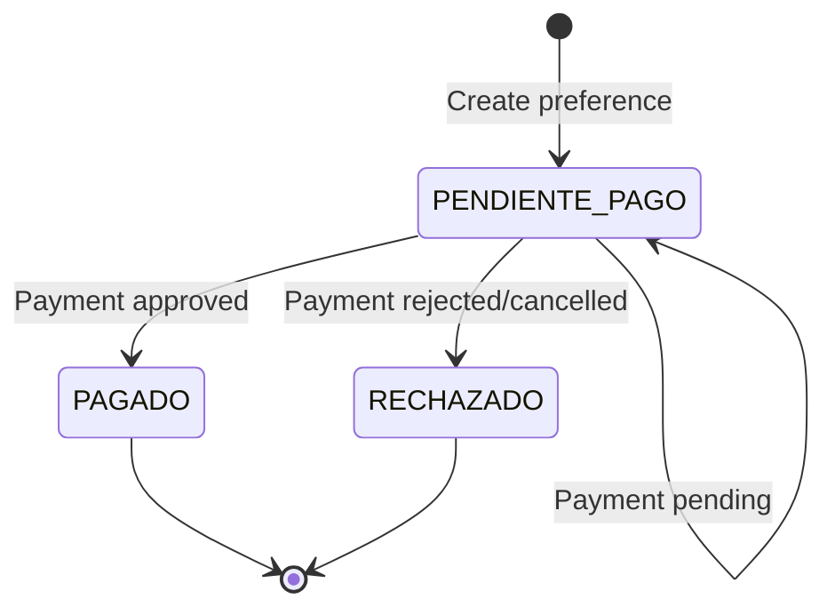

## Overview

MercadoPago is Latin America's leading payment platform, supporting credit/debit cards, digital wallets, and local payment methods. This integration uses the official MercadoPago SDK for Node.js.

## Prerequisites

<Card title="Required Credentials" icon="key">
  - MercadoPago account
  - Access Token (production or sandbox)
  - Webhook URL configured in MercadoPago dashboard
</Card>

## Configuration

### Environment Variables

Add these to your Firebase Functions configuration:

```bash
MP_ACCESS_TOKEN=your_mercadopago_access_token
```

### Code Configuration

In `~/workspace/source/functions/mercadopago.js:5-11`:

```javascript
const { MercadoPagoConfig, Preference, Payment } = require("mercadopago");

const MP_TOKEN = process.env.MP_ACCESS_TOKEN;
const client = MP_TOKEN ? new MercadoPagoConfig({ 
  accessToken: MP_TOKEN 
}) : null;

const WEBHOOK_URL = "https://us-central1-pixeltechcol.cloudfunctions.net/mercadoPagoWebhook";
```

## Creating Payment Preferences

### Function: `createPreference`

Creates a MercadoPago checkout preference with 30-minute expiration.

### Parameters

<ParamField path="userToken" type="string">
  Firebase authentication token (alternative to context.auth)
</ParamField>

<ParamField path="items" type="array" required>
  Array of cart items
  
  <Expandable title="Item properties">
    <ResponseField name="id" type="string" required>
      Product ID from Firestore
    </ResponseField>
    <ResponseField name="quantity" type="number" required>
      Quantity to purchase
    </ResponseField>
    <ResponseField name="color" type="string">
      Product variant color
    </ResponseField>
    <ResponseField name="capacity" type="string">
      Product variant capacity
    </ResponseField>
  </Expandable>
</ParamField>

<ParamField path="shippingCost" type="number" default="0">
  Shipping cost in COP
</ParamField>

<ParamField path="buyerInfo" type="object" required>
  Customer information
  
  <Expandable title="Buyer properties">
    <ResponseField name="name" type="string" required>
      Customer full name
    </ResponseField>
    <ResponseField name="phone" type="string" required>
      Phone number with area code
    </ResponseField>
    <ResponseField name="address" type="string" required>
      Street address
    </ResponseField>
    <ResponseField name="postal" type="string">
      Postal code
    </ResponseField>
  </Expandable>
</ParamField>

<ParamField path="extraData" type="object">
  Additional order data
  
  <Expandable title="Extra data properties">
    <ResponseField name="userName" type="string">
      Override customer name
    </ResponseField>
    <ResponseField name="phone" type="string">
      Override phone number
    </ResponseField>
    <ResponseField name="clientDoc" type="string">
      Customer document number
    </ResponseField>
    <ResponseField name="shippingData" type="object">
      Detailed shipping information
    </ResponseField>
    <ResponseField name="billingData" type="object">
      Billing information if different
    </ResponseField>
    <ResponseField name="needsInvoice" type="boolean">
      Request tax invoice
    </ResponseField>
  </Expandable>
</ParamField>

### Example Request

```javascript
const createPreference = firebase.functions().httpsCallable('createPreference');

const result = await createPreference({
  userToken: await firebase.auth().currentUser.getIdToken(),
  items: [
    {
      id: 'prod_123',
      quantity: 2,
      color: 'Negro',
      capacity: '128GB'
    }
  ],
  shippingCost: 15000,
  buyerInfo: {
    name: 'Juan Pérez',
    phone: '3001234567',
    address: 'Calle 123 #45-67',
    postal: '110111'
  },
  extraData: {
    clientDoc: '1234567890',
    needsInvoice: false,
    shippingData: {
      address: 'Calle 123 #45-67',
      city: 'Bogotá',
      department: 'Cundinamarca'
    }
  }
});

console.log(result.data);
// { preferenceId: 'xxxxx', initPoint: 'https://www.mercadopago.com.co/checkout/v1/redirect?pref_id=xxxxx' }
```

### Response

<ResponseField name="preferenceId" type="string">
  MercadoPago preference ID
</ResponseField>

<ResponseField name="initPoint" type="string">
  Checkout URL to redirect the customer
</ResponseField>

## Implementation Flow

From `~/workspace/source/functions/mercadopago.js:18-165`:

### 1. Authentication

```javascript
const userToken = data.userToken;
let uid, email;

if (userToken) {
  const decodedToken = await auth.verifyIdToken(userToken);
  uid = decodedToken.uid;
  email = decodedToken.email;
} else if (context.auth) {
  uid = context.auth.uid;
  email = context.auth.token.email;
} else {
  throw new Error("Sin credenciales.");
}
```

### 2. Price Validation

Always validate prices from the database:

```javascript
for (const item of rawItems) {
  const pDoc = await db.collection('products').doc(item.id).get();
  if (!pDoc.exists) continue;
  
  const pData = pDoc.data();
  const realPrice = Number(pData.price) || 0; // Server-side price
  const quantity = parseInt(item.quantity) || 1;
  
  subtotal += realPrice * quantity;
  
  mpItems.push({
    id: item.id,
    title: pData.name,
    quantity: quantity,
    unit_price: realPrice,
    currency_id: 'COP',
    picture_url: pData.mainImage || ''
  });
}
```

### 3. Create Order in Firestore

```javascript
const newOrderRef = db.collection('orders').doc();

await newOrderRef.set({
  source: 'TIENDA_WEB',
  createdAt: admin.firestore.FieldValue.serverTimestamp(),
  userId: uid,
  userEmail: email,
  userName: extraData.userName || buyerInfo.name,
  phone: extraData.phone || buyerInfo.phone || "",
  clientDoc: extraData.clientDoc || "",
  
  shippingData: shippingData,
  items: dbItems,
  subtotal: subtotal,
  shippingCost: shippingCost,
  total: totalAmount,
  
  status: 'PENDIENTE_PAGO',
  paymentMethod: 'MERCADOPAGO',
  paymentStatus: 'PENDING',
  isStockDeducted: false
});
```

### 4. Set Expiration (30 Minutes)

```javascript
const expirationDate = new Date();
expirationDate.setMinutes(expirationDate.getMinutes() + 30);
```

### 5. Create MercadoPago Preference

```javascript
const preference = new Preference(client);
const result = await preference.create({
  body: {
    items: mpItems,
    payer: {
      name: buyerInfo.name,
      email: email,
      phone: { area_code: "57", number: buyerInfo.phone },
      address: { street_name: buyerInfo.address, zip_code: buyerInfo.postal }
    },
    back_urls: {
      success: "https://pixeltechcol.com/shop/success.html",
      failure: "https://pixeltechcol.com/shop/success.html",
      pending: "https://pixeltechcol.com/shop/success.html"
    },
    auto_return: "approved",
    statement_descriptor: "PIXELTECH",
    external_reference: newOrderRef.id,
    notification_url: WEBHOOK_URL,
    date_of_expiration: expirationDate.toISOString()
  }
});

return { preferenceId: result.id, initPoint: result.init_point };
```

## Webhook Handling

### Function: `webhook`

Processes payment notifications from MercadoPago.

### Webhook URL Setup

Configure in MercadoPago dashboard:
```
https://us-central1-pixeltechcol.cloudfunctions.net/mercadoPagoWebhook
```

### Webhook Flow

From `~/workspace/source/functions/mercadopago.js:174-326`:

#### 1. Extract Payment ID

```javascript
const paymentId = req.query.id || 
                  req.query['data.id'] || 
                  req.body?.data?.id || 
                  req.body?.id;
const topic = req.query.topic || req.body?.topic;

// Ignore merchant_order notifications
if (topic === 'merchant_order') return res.status(200).send("OK");
if (!paymentId) return res.status(200).send("OK");
```

#### 2. Verify Payment Status

```javascript
const payment = new Payment(client);
const paymentData = await payment.get({ id: paymentId });

const status = paymentData.status; // approved, rejected, cancelled, pending
const orderId = paymentData.external_reference;
```

#### 3. Process Approved Payments

```javascript
if (status === 'approved') {
  await db.runTransaction(async (t) => {
    const docSnap = await t.get(orderRef);
    
    // Prevent duplicate processing
    if (!docSnap.exists || docSnap.data().status === 'PAGADO') return;
    
    const oData = docSnap.data();
    
    // 1. Deduct inventory
    if (!oData.isStockDeducted) {
      for (const item of oData.items) {
        const pRef = db.collection('products').doc(item.id);
        const pDoc = await t.get(pRef);
        
        if (pDoc.exists) {
          const pData = pDoc.data();
          let newStock = (pData.stock || 0) - (item.quantity || 1);
          let combinations = pData.combinations || [];
          
          // Handle variants
          if (item.color || item.capacity) {
            const idx = combinations.findIndex(c => 
              (c.color === item.color || (!c.color && !item.color)) &&
              (c.capacity === item.capacity || (!c.capacity && !item.capacity))
            );
            if (idx >= 0) {
              combinations[idx].stock = Math.max(0, combinations[idx].stock - item.quantity);
            }
          }
          
          t.update(pRef, { 
            stock: Math.max(0, newStock), 
            combinations: combinations 
          });
        }
      }
    }
    
    // 2. Update treasury
    const accQ = await t.get(
      db.collection('accounts')
        .where('gatewayLink', '==', 'MERCADOPAGO')
        .limit(1)
    );
    
    let accDoc = accQ.empty ? null : accQ.docs[0];
    
    if (accDoc) {
      // Update balance
      t.update(accDoc.ref, { 
        balance: (Number(accDoc.data().balance) || 0) + Number(oData.total)
      });
      
      // Create income record
      const incRef = db.collection('expenses').doc();
      t.set(incRef, {
        amount: Number(oData.total),
        category: "Ingreso Ventas Online",
        description: `Venta MP #${orderId.slice(0, 8)}`,
        paymentMethod: accDoc.data().name,
        date: admin.firestore.FieldValue.serverTimestamp(),
        type: 'INCOME',
        orderId: orderId,
        supplierName: oData.userName
      });
    }
    
    // 3. Create remission
    const remRef = db.collection('remissions').doc(orderId);
    t.set(remRef, {
      orderId,
      source: 'WEBHOOK_MP',
      items: oData.items,
      clientName: oData.userName,
      clientPhone: oData.phone,
      clientDoc: oData.clientDoc,
      clientAddress: `${oData.shippingData?.address}, ${oData.shippingData?.city}`,
      total: oData.total,
      status: 'PENDIENTE_ALISTAMIENTO',
      type: 'VENTA_WEB',
      createdAt: admin.firestore.FieldValue.serverTimestamp()
    });
    
    // 4. Update order
    t.update(orderRef, {
      status: 'PAGADO',
      paymentStatus: 'PAID',
      paymentId: paymentId,
      updatedAt: admin.firestore.FieldValue.serverTimestamp(),
      isStockDeducted: true
    });
  });
}
```

#### 4. Handle Rejected Payments

```javascript
else if (status === 'rejected' || status === 'cancelled') {
  await orderRef.update({
    status: 'RECHAZADO',
    paymentId: paymentId,
    statusDetail: paymentData.status_detail,
    updatedAt: admin.firestore.FieldValue.serverTimestamp()
  });
}
```

## Payment Status Flow



## MercadoPago Status Codes

### Payment Statuses

| Status | Description | Order Action |
|--------|-------------|-------------|
| `approved` | Payment approved | Set to PAGADO, deduct stock |
| `pending` | Payment in process | Keep as PENDIENTE_PAGO |
| `rejected` | Payment rejected | Set to RECHAZADO |
| `cancelled` | Payment cancelled by user | Set to RECHAZADO |
| `refunded` | Payment refunded | Manual handling required |
| `charged_back` | Chargeback filed | Manual handling required |

### Status Details

Common `status_detail` values:

- `accredited` - Payment credited
- `cc_rejected_bad_filled_card_number` - Invalid card number
- `cc_rejected_bad_filled_date` - Invalid expiration date
- `cc_rejected_bad_filled_security_code` - Invalid security code
- `cc_rejected_insufficient_amount` - Insufficient funds
- `cc_rejected_high_risk` - Rejected for risk

## Testing

### Sandbox Configuration

1. Create a test account at https://www.mercadopago.com.co/developers
2. Get test access token
3. Set `MP_ACCESS_TOKEN` to test token
4. Use test cards from MercadoPago docs

### Test Cards

**Approved:**
```
Card: 5031 7557 3453 0604
CVV: 123
Expiry: 11/25
```

**Rejected (insufficient funds):**
```
Card: 5031 4332 1540 6351
CVV: 123
Expiry: 11/25
```

### Test Webhook

Test webhook locally using ngrok:

```bash
ngrok http 5001
# Update WEBHOOK_URL to ngrok URL
```

## Treasury Configuration

Create a treasury account linked to MercadoPago:

```javascript
// In Firestore: accounts collection
{
  name: "MercadoPago",
  gatewayLink: "MERCADOPAGO",
  balance: 0,
  isDefaultOnline: true, // Optional fallback
  type: "ONLINE_PAYMENT"
}
```

## Error Handling

### Common Errors

<AccordionGroup>
  <Accordion title="Pasarela no configurada">
    **Cause:** `MP_ACCESS_TOKEN` not set
    
    **Solution:** Add token to environment variables
    ```bash
    firebase functions:config:set mercadopago.token="YOUR_TOKEN"
    ```
  </Accordion>

  <Accordion title="Sin credenciales">
    **Cause:** User not authenticated
    
    **Solution:** Ensure `userToken` is passed or user is logged in via Firebase Auth
  </Accordion>

  <Accordion title="El carrito está vacío">
    **Cause:** No items in cart
    
    **Solution:** Validate cart has items before calling function
  </Accordion>

  <Accordion title="Webhook timeout">
    **Cause:** Slow Firestore operations
    
    **Solution:** MercadoPago will retry. Webhook should be idempotent.
  </Accordion>
</AccordionGroup>

## Best Practices

<Check>**Always validate prices server-side** - Never trust client-submitted prices</Check>
<Check>**Use transactions** - Prevent race conditions in stock updates</Check>
<Check>**Set expiration times** - 30 minutes is recommended</Check>
<Check>**Log all events** - Helps with debugging and reconciliation</Check>
<Check>**Handle all statuses** - Including pending, refunded, and charged_back</Check>

## Monitoring

### Key Metrics to Track

- Payment creation success rate
- Webhook processing time
- Failed payment reasons
- Stock deduction accuracy
- Treasury balance reconciliation

### Logging

All operations are logged:

```javascript
console.log("🚀 Iniciando Checkout MP...");
console.log("✅ MP Order Approved:", orderId);
console.log("❌ MP Order Rejected:", orderId);
console.error("❌ Error MP Create:", error);
```

## Next Steps

<CardGroup cols={2}>
  <Card title="Add ADDI" icon="calendar-days" href="/integrations/addi">
    Add buy now, pay later option
  </Card>
  <Card title="Configure Treasury" icon="vault" href="/admin/accounting">
    Set up payment accounts
  </Card>
  <Card title="Webhook Guide" icon="webhook" href="/integrations/payment-gateways#webhook-handling">
    Learn more about webhooks
  </Card>
  <Card title="Order Management" icon="box" href="/admin/orders">
    Manage incoming orders
  </Card>
</CardGroup>