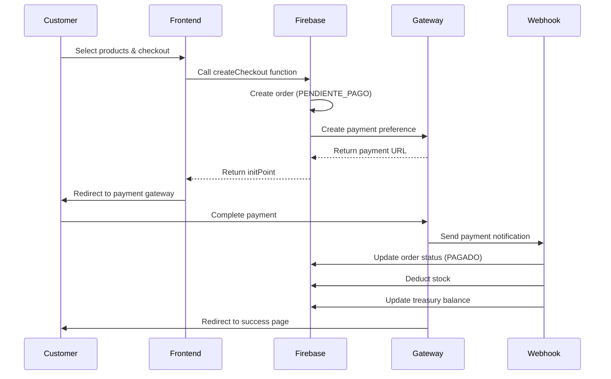

## Available Payment Methods

PixelTech Colombia supports multiple payment gateways to provide flexible payment options for your customers:

<CardGroup cols={3}>
  <Card title="MercadoPago" icon="circle-dollar" href="/integrations/mercadopago">
    Credit/debit cards and digital wallets
  </Card>
  <Card title="ADDI" icon="calendar-days" href="/integrations/addi">
    Buy now, pay later financing
  </Card>
  <Card title="Sistecrédito" icon="building-columns" href="/integrations/sistecredito">
    Credit financing solutions
  </Card>
</CardGroup>

## Payment Flow Overview

All payment gateways follow a consistent flow:



## Common Order Lifecycle

All payment gateways create orders with the following status flow:

### Order Statuses

| Status | Description |
|--------|-------------|
| `PENDIENTE_PAGO` | Order created, awaiting payment |
| `PAGADO` | Payment approved and confirmed |
| `RECHAZADO` | Payment rejected or cancelled |

### Payment Statuses

| Status | Description |
|--------|-------------|
| `PENDING` | Payment initiated but not completed |
| `PAID` | Payment successfully completed |

## Order Data Structure

All payment gateways create orders in Firestore with this structure:

```javascript
{
  source: 'TIENDA_WEB',
  createdAt: Timestamp,
  userId: string,
  userEmail: string,
  userName: string,
  phone: string,
  clientDoc: string,
  
  shippingData: {
    address: string,
    city: string,
    department: string
  },
  billingData: object | null,
  requiresInvoice: boolean,
  
  items: [{
    id: string,
    name: string,
    price: number,
    quantity: number,
    color: string,
    capacity: string,
    mainImage: string
  }],
  
  subtotal: number,
  shippingCost: number,
  total: number,
  
  status: 'PENDIENTE_PAGO' | 'PAGADO' | 'RECHAZADO',
  paymentMethod: 'MERCADOPAGO' | 'ADDI' | 'SISTECREDITO',
  paymentStatus: 'PENDING' | 'PAID',
  paymentId: string,
  isStockDeducted: boolean
}
```

## Webhook Handling

All payment gateways use webhooks to notify your system of payment status changes. The webhook flow is consistent:

### Webhook Security

- All webhooks validate the payment status by querying the gateway API
- Never trust client-side data alone
- Use transactions to prevent race conditions

### Webhook Actions

When a payment is approved, webhooks automatically:

1. **Validate order exists** - Check if the order hasn't already been processed
2. **Deduct inventory** - Reduce stock for ordered products and variants
3. **Update treasury** - Add payment to the linked account balance
4. **Create income record** - Log transaction in expenses collection
5. **Generate remission** - Create fulfillment document for warehouse
6. **Update order status** - Mark order as PAGADO with payment details

### Duplicate Prevention

All webhooks include duplicate detection:

```javascript
if (orderData.paymentStatus === 'PAID' || orderData.status === 'PAGADO') {
  console.log('⚠️ Duplicate webhook ignored');
  return;
}
```

## Stock Management

All payment gateways handle inventory deduction with support for:

- **Simple products** - Direct stock reduction
- **Product variants** - Stock reduction by color/capacity combination
- **Atomic transactions** - Prevents overselling

```javascript
// Stock deduction example from webhook
for (const item of order.items) {
  const product = await getProduct(item.id);
  let newStock = product.stock - item.quantity;
  
  // Handle variants
  if (item.color || item.capacity) {
    const variant = product.combinations.find(c => 
      c.color === item.color && c.capacity === item.capacity
    );
    if (variant) {
      variant.stock = Math.max(0, variant.stock - item.quantity);
    }
  }
  
  await updateProduct(item.id, { stock: Math.max(0, newStock) });
}
```

## Treasury Integration

Payments are automatically recorded in the treasury system:

### Account Linking

Each payment gateway can be linked to a treasury account using the `gatewayLink` field:

- **MercadoPago** → `gatewayLink: 'MERCADOPAGO'`
- **ADDI** → `gatewayLink: 'ADDI'`
- **Sistecrédito** → `gatewayLink: 'SISTECREDITO'`

Fallback: If no linked account is found, the system uses `isDefaultOnline: true`.

### Income Recording

Every successful payment creates an income record:

```javascript
{
  amount: number,
  category: "Ingreso Ventas Online",
  description: `Venta ${gateway} #${orderId}`,
  paymentMethod: accountName,
  date: Timestamp,
  type: 'INCOME',
  orderId: string,
  supplierName: customerName
}
```

## Error Handling

All payment functions include comprehensive error handling:

### Authentication Errors

```javascript
throw new functions.https.HttpsError('unauthenticated', 
  'Debes iniciar sesión para comprar.');
```

### Validation Errors

```javascript
throw new functions.https.HttpsError('invalid-argument', 
  'El carrito está vacío.');
```

### Gateway Errors

```javascript
throw new functions.https.HttpsError('internal', 
  'Error iniciando pago con [Gateway].');
```

## Testing Payments

### Development Mode

Each gateway supports sandbox/testing modes:

- **MercadoPago**: Use test access token
- **ADDI**: Set `IS_SANDBOX = true` (uses api.addi-staging.com)
- **Sistecrédito**: Set `IS_SC_SANDBOX = true`

### Test Flow

1. Create a test order with real product IDs from your database
2. Use test credentials for the payment gateway
3. Complete payment in sandbox environment
4. Verify webhook receives notification
5. Check order status updates to PAGADO
6. Confirm stock was deducted
7. Verify treasury balance increased

### Test Data Requirements

<ParamField path="userToken" type="string" required>
  Firebase authentication token for the test user
</ParamField>

<ParamField path="items" type="array" required>
  Array of products with valid IDs from your products collection
</ParamField>

<ParamField path="buyerInfo" type="object" required>
  Complete buyer information including name, email, phone, and address
</ParamField>

## Best Practices

<AccordionGroup>
  <Accordion title="Security">
    - Always validate prices on the server by querying the products collection
    - Never trust client-submitted prices
    - Use Firebase Authentication for all checkout requests
    - Validate webhook payloads by querying the gateway API
  </Accordion>

  <Accordion title="User Experience">
    - Set payment expiration times (MercadoPago: 30 minutes)
    - Provide clear error messages
    - Redirect users to appropriate success/failure pages
    - Send confirmation emails after successful payment
  </Accordion>

  <Accordion title="Data Integrity">
    - Use Firestore transactions for all stock updates
    - Implement duplicate webhook detection
    - Set `isStockDeducted` flag to prevent double deduction
    - Log all webhook events for debugging
  </Accordion>

  <Accordion title="Monitoring">
    - Log all payment creation attempts
    - Monitor webhook response times
    - Track failed payments and reasons
    - Alert on unusual error rates
  </Accordion>
</AccordionGroup>

## Next Steps

<CardGroup cols={2}>
  <Card title="Configure MercadoPago" icon="circle-dollar" href="/integrations/mercadopago">
    Set up credit card payments
  </Card>
  <Card title="Add ADDI Financing" icon="calendar-days" href="/integrations/addi">
    Enable buy now, pay later
  </Card>
  <Card title="Configure Sistecrédito" icon="building-columns" href="/integrations/sistecredito">
    Add credit financing
  </Card>
  <Card title="Treasury Setup" icon="vault" href="/admin/accounting">
    Configure payment accounts
  </Card>
</CardGroup>