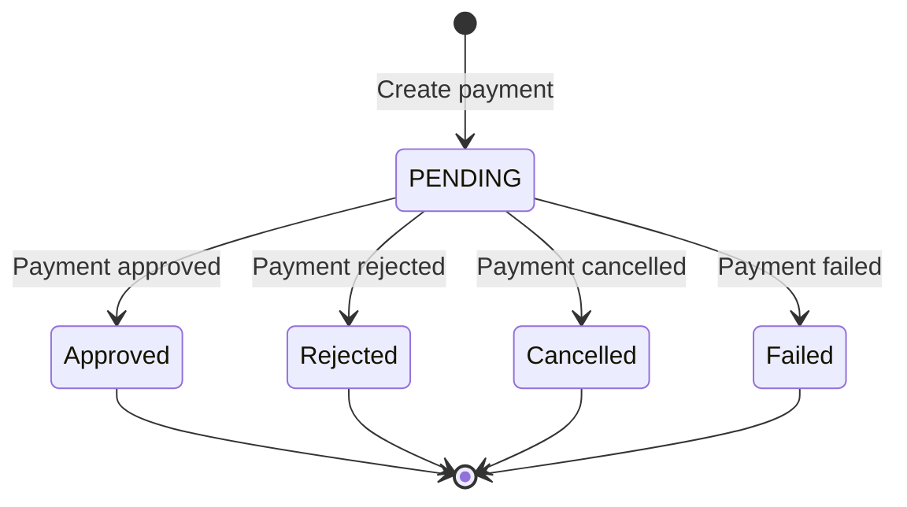

## Overview

Sistecrédito is a Colombian credit financing platform that provides instant credit approval and flexible payment options. This integration uses the Credinet Pay API.

<Info>Sistecrédito offers quick credit decisions, making it ideal for customers who prefer financing options.</Info>

## Prerequisites

<Card title="Required Credentials" icon="key">
  - Sistecrédito merchant account
  - API Key (Ocp-Apim-Subscription-Key)
  - Application Key
  - Application Token
  - Webhook URL configured
</Card>

## Configuration

### Environment Variables

Add these to your Firebase Functions configuration:

```bash
SC_API_KEY=your_subscription_key
SC_APP_KEY=your_application_key
SC_APP_TOKEN=your_application_token
```

### Code Configuration

From `~/workspace/source/functions/sistecredito.js:6-17`:

```javascript
const IS_SC_SANDBOX = false; // Set to true for testing

const SC_API_KEY = process.env.SC_API_KEY;
const SC_APP_KEY = process.env.SC_APP_KEY;
const SC_APP_TOKEN = process.env.SC_APP_TOKEN;

const SC_BASE_URL = "https://api.credinet.co/pay";
const SC_ORIGEN = IS_SC_SANDBOX ? "Staging" : "Production";
const SC_WEBHOOK_URL = "https://sistecreditowebhook-muiondpggq-uc.a.run.app";
```

## Creating Sistecrédito Checkout

### Function: `createSistecreditoCheckout`

Creates a Sistecrédito payment request.

### Parameters

<ParamField path="userToken" type="string">
  Firebase authentication token
</ParamField>

<ParamField path="items" type="array" required>
  Array of cart items with product IDs from Firestore
</ParamField>

<ParamField path="shippingCost" type="number" default="0">
  Shipping cost in COP
</ParamField>

<ParamField path="buyerInfo" type="object" required>
  Customer information
  
  <Expandable title="Buyer properties">
    <ResponseField name="name" type="string" required>
      Customer full name
    </ResponseField>
    <ResponseField name="document" type="string" required>
      Colombian ID number (Cédula)
    </ResponseField>
    <ResponseField name="phone" type="string" required>
      Colombian mobile number
    </ResponseField>
    <ResponseField name="address" type="string" required>
      Street address
    </ResponseField>
    <ResponseField name="city" type="string" required>
      City name (without special characters)
    </ResponseField>
    <ResponseField name="department" type="string">
      Department/State
    </ResponseField>
  </Expandable>
</ParamField>

<ParamField path="extraData" type="object">
  Additional order information
</ParamField>

### Example Request

```javascript
const createSistecreditoCheckout = firebase.functions().httpsCallable('createSistecreditoCheckout');

const result = await createSistecreditoCheckout({
  userToken: await firebase.auth().currentUser.getIdToken(),
  items: [
    {
      id: 'prod_456',
      quantity: 1,
      color: 'Azul',
      capacity: '512GB'
    }
  ],
  shippingCost: 25000,
  buyerInfo: {
    name: 'Carlos Rodríguez',
    document: '9876543210',
    phone: '3109876543',
    address: 'Avenida 68 #123-45',
    city: 'Bogotá',
    department: 'Cundinamarca'
  },
  extraData: {
    needsInvoice: true
  }
});

console.log(result.data);
// { initPoint: 'https://api.credinet.co/pay/...' }
```

### Response

<ResponseField name="initPoint" type="string">
  Sistecrédito payment URL to redirect the customer
</ResponseField>

## Implementation Flow

From `~/workspace/source/functions/sistecredito.js:22-167`:

### 1. Authenticate User

```javascript
const userToken = data.userToken;
let uid, email;

if (userToken) {
  const decoded = await auth.verifyIdToken(userToken);
  uid = decoded.uid;
  email = decoded.email;
} else if (context.auth) {
  uid = context.auth.uid;
  email = context.auth.token.email;
} else {
  throw new Error("User auth failed");
}
```

### 2. Process Items and Calculate Total

```javascript
let dbItems = [];
let subtotal = 0;

const removeAccents = (str) => 
  str ? str.normalize("NFD").replace(/[\u0300-\u036f]/g, "") : "";

for (const item of rawItems) {
  const pDoc = await db.collection('products').doc(item.id).get();
  if (!pDoc.exists) continue;
  
  const pData = pDoc.data();
  const price = Number(pData.price) || 0;
  const qty = parseInt(item.quantity) || 1;
  subtotal += price * qty;

  dbItems.push({
    id: item.id,
    name: pData.name,
    price: price,
    quantity: qty,
    color: item.color || "",
    capacity: item.capacity || "",
    mainImage: pData.mainImage || pData.image || "https://pixeltechcol.com/img/logo.png"
  });
}

const totalAmount = subtotal + shippingCost;
```

### 3. Create Order in Firestore

```javascript
const newOrderRef = db.collection('orders').doc();
const firebaseOrderId = newOrderRef.id;

await newOrderRef.set({
  source: 'TIENDA_WEB',
  createdAt: admin.firestore.FieldValue.serverTimestamp(),
  userId: uid,
  userEmail: email,
  userName: clientName,
  phone: clientPhone,
  clientDoc: clientDoc,
  shippingData: shippingData,
  items: dbItems,
  subtotal: subtotal,
  shippingCost: shippingCost,
  total: totalAmount,
  status: 'PENDIENTE_PAGO',
  paymentMethod: 'SISTECREDITO',
  paymentStatus: 'PENDING',
  isStockDeducted: false
});
```

### 4. Prepare Sistecrédito Payload

Critical data cleaning for Sistecrédito API:

```javascript
// Clean document
const cleanDoc = String(clientDoc).replace(/\D/g, '');

// Parse name
const fullNameParts = String(clientName).trim().split(" ");
const firstName = fullNameParts[0];
const lastName = fullNameParts.slice(1).join(" ") || "Apellido";

// Format phone
let rawPhone = String(clientPhone).replace(/\D/g, '');
let cellNumber = rawPhone.startsWith('57') ? rawPhone.substring(2) : rawPhone;
if (!cellNumber) cellNumber = "3000000000";

// Clean city - CRITICAL FOR SISTECREDITO
let cleanCity = removeAccents(shippingData.city || "Bogota").trim();
if (cleanCity.toLowerCase().includes("bogota")) {
  cleanCity = "Bogota"; // Must be "Bogota" without "D.C."
}
// Remove any special characters
cleanCity = cleanCity.replace(/[^a-zA-Z0-9\s]/g, '').trim();
```

<Warning>
  **Important:** Sistecrédito is strict about city names. Use "Bogota" not "Bogotá" or "Bogota D.C."
</Warning>

### 5. Create Sistecrédito Payment

From `~/workspace/source/functions/sistecredito.js:113-166`:

```javascript
const payload = {
  invoice: firebaseOrderId,
  description: `Compra en PixelTech - Orden ${firebaseOrderId.slice(0, 8)}`,
  paymentMethod: {
    paymentMethodId: 2, // Credit financing
    bankCode: 1,
    userType: 0
  },
  currency: "COP",
  value: Math.round(totalAmount),
  tax: 0,
  taxBase: 0,
  sandbox: {
    isActive: IS_SC_SANDBOX,
    status: "Approved"
  },
  urlResponse: `https://pixeltechcol.com/shop/success.html?order=${firebaseOrderId}`,
  urlConfirmation: SC_WEBHOOK_URL,
  methodConfirmation: "POST",
  client: {
    docType: "CC",
    document: cleanDoc || "11111111",
    name: removeAccents(firstName).substring(0, 50),
    lastName: removeAccents(lastName).substring(0, 50),
    email: String(email).trim().toLowerCase(),
    indCountry: "57",
    phone: cellNumber,
    country: "CO",
    city: cleanCity.substring(0, 50),
    address: removeAccents(String(shippingData.address || "Direccion")).substring(0, 100),
    ipAddress: "192.168.1.1"
  }
};

try {
  const response = await axios.post(
    `${SC_BASE_URL}/create`,
    payload,
    {
      headers: {
        'SCLocation': '0,0',
        'SCOrigen': SC_ORIGEN,
        'country': 'CO',
        'Ocp-Apim-Subscription-Key': SC_API_KEY,
        'ApplicationKey': SC_APP_KEY,
        'ApplicationToken': SC_APP_TOKEN,
        'Content-Type': 'application/json'
      }
    }
  );

  const redirectUrl = response.data?.data?.paymentMethodResponse?.paymentRedirectUrl;
  
  if (!redirectUrl) {
    throw new Error("Sistecrédito no devolvió URL de pago.");
  }

  return { initPoint: redirectUrl };
  
} catch (error) {
  console.error("❌ Error Sistecrédito:", error.response?.data || error.message);
  throw new functions.https.HttpsError('internal', "Error iniciando pago con Sistecrédito.");
}
```

## Sistecrédito API Headers

Required headers for all API requests:

<ParamField path="SCLocation" type="string" required>
  GPS coordinates (use "0,0" if unavailable)
</ParamField>

<ParamField path="SCOrigen" type="string" required>
  Environment: "Staging" or "Production"
</ParamField>

<ParamField path="country" type="string" required>
  Country code: "CO"
</ParamField>

<ParamField path="Ocp-Apim-Subscription-Key" type="string" required>
  API subscription key
</ParamField>

<ParamField path="ApplicationKey" type="string" required>
  Application key
</ParamField>

<ParamField path="ApplicationToken" type="string" required>
  Application token
</ParamField>

## Webhook Handling

### Function: `webhook`

Processes Sistecrédito payment notifications.

From `~/workspace/source/functions/sistecredito.js:172-289`:

### Webhook Payload

Sistecrédito sends POST requests with:

```json
{
  "data": {
    "_id": "transaction_id",
    "invoice": "firebase_order_id",
    "transactionStatus": "Approved" | "Rejected" | "Cancelled" | "Failed",
    "value": 150000
  }
}
```

### Processing Approved Payments

```javascript
if (status === 'Approved') {
  await db.runTransaction(async (t) => {
    const docSnap = await t.get(orderRef);
    if (!docSnap.exists) return;
    
    const oData = docSnap.data();
    
    // Prevent duplicate processing
    if (oData.paymentStatus === 'PAID' || oData.status === 'PAGADO') {
      console.log(`⚠️ Webhook duplicado ignorado. Orden ${orderId} ya pagada.`);
      return;
    }
    
    // 1. Deduct stock (same logic as other gateways)
    const prodReads = [];
    if (!oData.isStockDeducted) {
      for (const item of oData.items) {
        const pRef = db.collection('products').doc(item.id);
        const pDoc = await t.get(pRef);
        
        if (pDoc.exists) {
          const pData = pDoc.data();
          let newStock = (pData.stock || 0) - (item.quantity || 1);
          let combinations = pData.combinations || [];
          
          // Handle variants
          if (item.color || item.capacity) {
            const idx = combinations.findIndex(c =>
              (c.color === item.color || (!c.color && !item.color)) &&
              (c.capacity === item.capacity || (!c.capacity && !item.capacity))
            );
            if (idx >= 0) {
              combinations[idx].stock = Math.max(0, combinations[idx].stock - item.quantity);
            }
          }
          
          prodReads.push({ 
            ref: pRef, 
            stock: Math.max(0, newStock), 
            combos: combinations 
          });
        }
      }
    }
    
    // 2. Update treasury
    const accQ = await t.get(
      db.collection('accounts')
        .where('gatewayLink', '==', 'SISTECREDITO')
        .limit(1)
    );
    
    let accDoc = (!accQ.empty) ? accQ.docs[0] : null;
    
    if (!accDoc) {
      const defQ = await t.get(
        db.collection('accounts')
          .where('isDefaultOnline', '==', true)
          .limit(1)
      );
      if (!defQ.empty) accDoc = defQ.docs[0];
    }
    
    if (accDoc) {
      t.update(accDoc.ref, { 
        balance: (Number(accDoc.data().balance) || 0) + Number(oData.total)
      });
      
      const incRef = db.collection('expenses').doc();
      t.set(incRef, {
        amount: Number(oData.total),
        category: "Ingreso Ventas Online",
        description: `Venta Sistecrédito #${orderId.slice(0, 8)}`,
        paymentMethod: accDoc.data().name,
        date: admin.firestore.FieldValue.serverTimestamp(),
        type: 'INCOME',
        orderId: orderId,
        supplierName: oData.userName
      });
    }
    
    // 3. Apply stock updates
    for (const p of prodReads) {
      t.update(p.ref, { stock: p.stock, combinations: p.combos });
    }
    
    // 4. Create remission (if doesn't exist)
    const remRef = db.collection('remissions').doc(orderId);
    const remSnap = await t.get(remRef);
    
    if (!remSnap.exists) {
      t.set(remRef, {
        orderId,
        source: 'WEBHOOK_SISTECREDITO',
        items: oData.items,
        clientName: oData.userName,
        clientPhone: oData.phone,
        clientDoc: oData.clientDoc,
        clientAddress: `${oData.shippingData?.address}, ${oData.shippingData?.city}`,
        total: oData.total,
        status: 'PENDIENTE_ALISTAMIENTO',
        type: 'VENTA_WEB',
        createdAt: admin.firestore.FieldValue.serverTimestamp()
      });
    }
    
    // 5. Update order
    t.update(orderRef, {
      status: 'PAGADO',
      paymentStatus: 'PAID',
      paymentId: txData._id || 'SISTECREDITO',
      updatedAt: admin.firestore.FieldValue.serverTimestamp(),
      isStockDeducted: true
    });
  });
}
```

### Handling Failed Payments

```javascript
else if (status === 'Rejected' || status === 'Cancelled' || status === 'Failed') {
  const docCheck = await orderRef.get();
  
  if (docCheck.exists && docCheck.data().paymentStatus !== 'PAID') {
    await orderRef.update({
      status: 'RECHAZADO',
      statusDetail: status
    });
    console.log(`❌ Orden ${orderId} Rechazada/Cancelada por Sistecrédito`);
  }
}
```

## Sistecrédito Status Flow



## Transaction Status Codes

| Status | Description | Action |
|--------|-------------|--------|
| `Approved` | Payment approved and processed | Update to PAGADO, deduct stock |
| `Pending` | Payment in process | Keep as PENDIENTE_PAGO |
| `Rejected` | Payment rejected | Mark as RECHAZADO |
| `Cancelled` | Payment cancelled by user | Mark as RECHAZADO |
| `Failed` | Technical failure | Mark as RECHAZADO |

## Payment Methods

Sistecrédito supports multiple payment methods via `paymentMethodId`:

| ID | Method | Description |
|----|--------|-------------|
| `1` | PSE | Electronic bank transfer |
| `2` | Credit | Sistecrédito financing |
| `3` | Cash | Cash payment locations |

PixelTech uses `paymentMethodId: 2` for credit financing.

## Data Requirements

### City Name Handling

<Warning>
  Sistecrédito is very strict about city names. Must not contain:
  - Accents (á, é, í, ó, ú)
  - Special characters
  - Extra descriptors (like "D.C.")
</Warning>

```javascript
// Clean city implementation
let cleanCity = removeAccents(shippingData.city || "Bogota").trim();
if (cleanCity.toLowerCase().includes("bogota")) {
  cleanCity = "Bogota"; // NOT "Bogotá" or "Bogota D.C."
}
cleanCity = cleanCity.replace(/[^a-zA-Z0-9\s]/g, '').trim();
```

### Document Validation

```javascript
const cleanDoc = String(clientDoc).replace(/\D/g, '');
// Result: "1234567890" (numbers only)
```

### Address Length Limits

- **Name**: 50 characters max
- **Address**: 100 characters max
- **City**: 50 characters max

## Testing

### Sandbox Mode

Enable sandbox in configuration:

```javascript
const IS_SC_SANDBOX = true;
const SC_ORIGEN = "Staging";

// In payload
sandbox: {
  isActive: true,
  status: "Approved" // Force approval in sandbox
}
```

### Test Flow

1. Set `IS_SC_SANDBOX = true`
2. Create checkout with valid test data
3. Payment will be auto-approved in sandbox
4. Webhook will be triggered immediately
5. Verify order status changes to PAGADO
6. Check stock deduction
7. Confirm treasury update

### Test Customer Data

```javascript
{
  name: "Test User",
  document: "1234567890",
  phone: "3001234567",
  email: "test@example.com",
  address: "Calle 123",
  city: "Bogota" // No accents!
}
```

## Treasury Configuration

Create a Sistecrédito treasury account:

```javascript
// Firestore: accounts collection
{
  name: "Sistecrédito",
  gatewayLink: "SISTECREDITO",
  balance: 0,
  isDefaultOnline: false,
  type: "ONLINE_PAYMENT"
}
```

## Error Handling

<AccordionGroup>
  <Accordion title="Error iniciando pago con Sistecrédito">
    **Cause:** API error or invalid payload
    
    **Solution:** Check logs for detailed error from Sistecrédito API
    
    Common issues:
    - City name contains special characters
    - Invalid phone number format
    - Missing required fields
  </Accordion>

  <Accordion title="Sistecrédito no devolvió URL de pago">
    **Cause:** Invalid response from API
    
    **Solution:** Verify credentials and payload structure
  </Accordion>

  <Accordion title="City name validation error">
    **Cause:** City contains accents or special characters
    
    **Solution:** Use `removeAccents()` and strip special characters
    
    ```javascript
    cleanCity = removeAccents(city).replace(/[^a-zA-Z0-9\s]/g, '').trim();
    ```
  </Accordion>

  <Accordion title="Duplicate webhook processing">
    **Cause:** Sistecrédito sent multiple notifications
    
    **Solution:** Already handled - system checks `paymentStatus === 'PAID'`
  </Accordion>
</AccordionGroup>

## Best Practices

<Check>**Clean all data** - Remove accents and special characters</Check>
<Check>**Validate city names** - Use simple names without descriptors</Check>
<Check>**Test in sandbox** - Always test before production</Check>
<Check>**Monitor webhooks** - Track all status changes</Check>
<Check>**Handle retries** - Implement idempotent webhook processing</Check>

## Common Integration Issues

### Issue: Invalid city name

**Problem:** API rejects city names with accents or special characters

**Solution:**
```javascript
let cleanCity = removeAccents(city).trim();
if (cleanCity.toLowerCase().includes("bogota")) cleanCity = "Bogota";
cleanCity = cleanCity.replace(/[^a-zA-Z0-9\s]/g, '');
```

### Issue: Phone number format

**Problem:** API expects 10-digit Colombian mobile

**Solution:**
```javascript
let phone = String(phoneInput).replace(/\D/g, '');
if (phone.startsWith('57')) phone = phone.substring(2);
if (phone.length !== 10) phone = "3000000000"; // Fallback
```

## Monitoring

### Key Metrics

- Payment creation success rate
- Webhook processing time
- Approval vs rejection rate
- Average transaction value

### Logging

```javascript
console.log(`🚀 Iniciando Checkout Sistecrédito (${SC_ORIGEN})...`);
console.log("✅ Sistecrédito Approved Procesado Correctamente");
console.log(`❌ Orden ${orderId} Rechazada/Cancelada por Sistecrédito`);
```

## Next Steps

<CardGroup cols={2}>
  <Card title="MercadoPago" icon="circle-dollar" href="/integrations/mercadopago">
    Add credit card payments
  </Card>
  <Card title="ADDI" icon="calendar-days" href="/integrations/addi">
    Add another financing option
  </Card>
  <Card title="Treasury Setup" icon="vault" href="/admin/accounting">
    Configure Sistecrédito account
  </Card>
  <Card title="Order Management" icon="box" href="/admin/orders">
    Process Sistecrédito orders
  </Card>
</CardGroup>